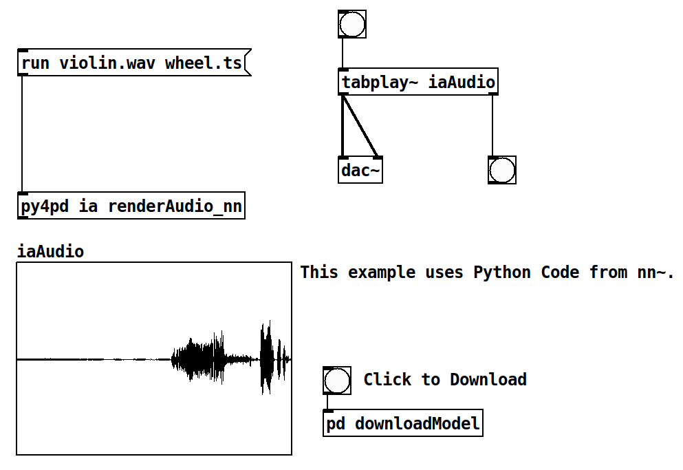

---
hide:
  - navigation
  - toc
---

# Introduction

<p align="center"> Welcome to the <code>py4pd</code> documentation! </p>

<p align="center" markdown>
  { width="6%" }
  { width="6%" }
</p>

## <h2 align="center"> **What is py4pd?** </h2>

---

<p><code>py4pd</code> bridges the capabilities of OpenMusic with the versatility of PureData. If you're familiar with <a href="https://openmusic-project.github.io/openmusic/">OpenMusic</a> and <a href="https://www.bachproject.net/">BachLibrary</a>, you'll discover a fresh source of inspiration here.</p>

<p >We achieve this by using Python instead of OpenMusic's Common Lisp, unlocking a vast array of powerful tools developed by composers and artists. This approach makes it easier to create music while seamlessly integrating extra code when needed.</p>

### <h3 align="center"> **PureData User** </h3>
<div class="grid cards" markdown>

-   :material-music-note: __OpenMusic Objects__

    [:octicons-arrow-right-24: NEED UPDATE](index.md)

-   :material-music-note: __`py4pd` Libraries__

    [:octicons-arrow-right-24: NEED UPDATE](index.md)
    

</div>

### <h3 align="center"> **Python User** </h3>
<div class="grid cards" markdown>

-   :simple-python: __Hello World__ 

    [:octicons-arrow-right-24: Hello World with `py4pd`](hello.md)

-   :simple-python: __Creating Libraries__

    [:octicons-arrow-right-24: Creating Pd Object with Python](pdmodule.md)
    
</div>


!!! info "How to install?"

    To check how to install go to [Installation](https://www.charlesneimog.com/py4pd/setup/).

<hr>


## <h2 align="center"> **Examples and Use Cases** </h2>

Here are presented tools implemented with `py4pd`. <i>Users are encouraged to contribute their examples through [Github](https://github.com/charlesneimog/py4pd/discussions/categories/show-and-tell) </i>.

=== "Artificial Inteligence"

    It is easy to use `AI` with `py4pd`. There are already powerful objects for real-time, like `nn~` and `ddsp~`, but they are designed to specify approaches. Below is an example using `py4pd` and the Python code used by `nn~` (offline processing).

    <p align="center">
        </img>
    </p>

    <p align="center">
        <audio controls style="width: 60%; border-radius: 10px;">
            <source src="./assets/turvo-wheel.wav" type="audio/mpeg">
            Your browser does not support the audio element.
        </audio>
    </p>

    ??? example end "Python Code"

        To illustrate the statement "Python offers a more accessible and user-friendly alternative than C and C++", presented earlier, here is an example of Python code:

        ``` py

        import pd # py4pd library
        import torch # Library of AI
        import librosa # Library to load audios in Python

        def renderAudio_nn(audio, model):
            model = pd.get_patch_dir() + '/' + model # get the pathname of model.ts, which is the result of the IA trained.
            audio = pd.get_patch_dir() + '/' +  audio # The audio source
            torch.set_grad_enabled(False) # config of the IA
            model = torch.jit.load(model).eval() # Load model of IA
            x = librosa.load(audio)[0] # take the audio samples of the sound (audio)
            x_for = torch.from_numpy(x).reshape(1, 1, -1) # transform the audio to fit in the IA model
            z = model.encode(x_for) # the black box
            z[:, 0] += torch.linspace(-2, 2, z.shape[-1]) # No idea;
            y = model.decode(z).numpy().reshape(-1) # Now we have sound again!
            pd.tabwrite('iaAudio', y.tolist(), resize=True) # Here we write the sound in the table 'iaAudio'.
            pd.print('Audio rendered')

        ```

=== "Graphics"

    With `py4pd`, we can create graphics in real-time, like the one below.

    <div style="text-align: center;">
        <video width="640" height="360" controls>
            <source src="assets/vispy.mp4" type="video/mp4">
            Your browser does not support the video tag.
        </video>
    </div>

---


## <h2 align="center"> **Pieces where I use it** </h2>

=== "Ideias Roubadas (2024)"

    Ideias Roubadas III is a work inspired by the proposal of the UPIC system, developed by Iannis Xenakis in collaboration with the Centre d'Etudes de Mathématique et Automatique Musicales (CEMAMu) in Paris. Like UPIC, this piece employs an approach that manipulates visual elements to generate music using PureData to render the audio. I employ the concept of instruments (inspired by Csound) to render the sounds. Each color represents a sound or a set of instructions for spacialization, envelope, and others.
    <p align="center">
        <iframe style="border-radius: 5px" width="560" height="315" src="https://www.youtube.com/embed/CuJsBlbFBeM?si=w6-aN2X__lMe9qlN" title="YouTube video player" frameborder="0" allow="accelerometer; autoplay; clipboard-write; encrypted-media; gyroscope; picture-in-picture; web-share" allowfullscreen></iframe>
    </p>


=== "Eco (2023)"

    Eco (2023) is the first version of one under-developing piece that uses some concepts of the composer Ricardo Thomasi in his PhD research. The idea here is to use smartphones/tablets put in the performance music stand, to make real-time `FFT` and `Partial Tracking` and then, generate scores that are played. The smartphones/tablets send data to PureData, and using `py4pd`, we generate real-time scores using `neoscore`.

    <p align="center">
        <iframe style="border-radius: 5px" width="560" height="315" src="https://www.youtube.com/embed/XIEI7-W7t2o" title="YouTube video player" frameborder="0" allow="accelerometer; autoplay; clipboard-write; encrypted-media; gyroscope; picture-in-picture; web-share" allowfullscreen></iframe>
    </p>

=== "Moteto (2023)"

    The piece Moteto aims to be a rereading of a medieval motet. In addition, to overlapping independent voices, we use Just Intonation structures. With the help of technology, I aim to make the piece playable, also by amateur choirs, it is available on this website: www.charlesneimog.com/moteto/.
    <p align="center">
        <iframe style="border-radius: 5px" width="560" height="315" src="https://www.youtube.com/embed/TVcHzLCmpDM?si=GIkYPPifzjhfFZvM" title="YouTube video player" frameborder="0" allow="accelerometer; autoplay; clipboard-write; encrypted-media; gyroscope; picture-in-picture; web-share" allowfullscreen></iframe>
    </p>
    
    
    

