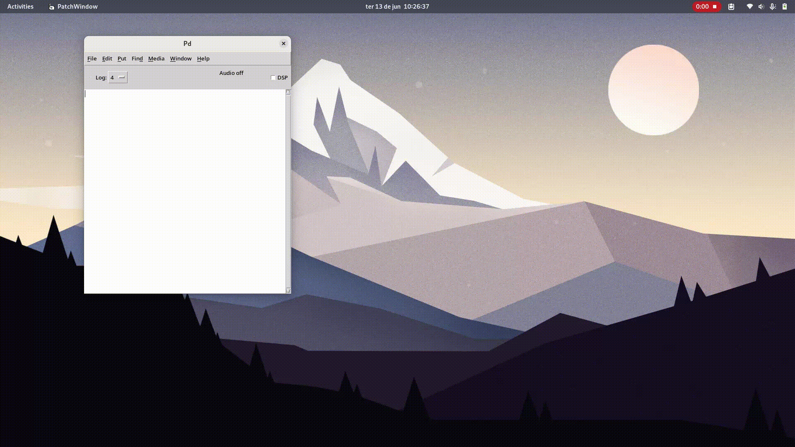

---
hide:
  - navigation
  - toc
---
# External Libraries

For those unfamiliar with programming, `py4pd` will be useful through its libraries. In essence, these libraries consist of Python code that can be used as PureData Objects. Because of the simplicity of Python, there is a new world of possibilities for PureData Objects. Presented below is a compilation of libraries used, for now, in my musical composition workflows. **If you created a library**, let me know to put it here too. 

!!! danger ""

    
Check <code>py4pd</code> installation process [here](setup.md).

You can download the libraries using `deken`. To install the library search for the library name.

??? info "Gif of installation process"

    <figure markdown>
      { width="70%" loading="lazy"}
      <figcaption>Process of install py4pd-ji on PureData</figcaption>
    </figure>

--------------------------

### <h3 style="text-align:center"> **List of Libraries** </h3>

<table class="special-table">
    <thead>
      <tr>
        <th>Library Name</th>
        <th>Description</th>
        <th>Author</th>
      </tr>
    </thead>
    <tbody>
      <tr>
        <td><a href="https://github.com/charlesneimog/py4pd-ji">py4pd-ji</a></td>
        <td>It creates an environment for the microtonal music composition, mainly for Just Intonation composition.</td>
        <td><a href="https://charlesneimog.github.io/"</a> Charles K. Neimog</td>
      </tr>
    </tbody>
    <tbody>
      <tr>
        <td><a href="https://github.com/charlesneimog/orchidea">orchidea</a></td>
        <td>It allows loading <a href="https://forum.ircam.fr/projects/detail/orchideasol/">Orchidea</a> samples using midi inputs.</td>
        <td><a href="https://charlesneimog.github.io/"</a> Charles K. Neimog</td>
      </tr>
    </tbody>
    <tbody>
      <tr>
        <td><a href="https://github.com/charlesneimog/py4pd-upic">py4pd-upic</a></td>
        <td>It allows to convert svg to audio parameters</td>
        <td><a href="https://charlesneimog.github.io/"</a> Charles K. Neimog</td>
      </tr>
    </tbody>
    <tbody>
      <tr>
        <td><a href="https://github.com/charlesneimog/py4pd-partials">py4pd-partials</a></td>
        <td>It allows to do Partial Tracking in PureData (under development yet)</td>
        <td><a href="https://charlesneimog.github.io/"</a> Charles K. Neimog</td>
      </tr>
    </tbody>
    <tbody>
      <tr>
        <td><a href="https://github.com/charlesneimog/py4pd-freesound">py4pd-freesound</a></td>
        <td>Get freesound sound in PureData (under development yet)</td>
        <td><a href="https://charlesneimog.github.io/"</a> Charles K. Neimog</td>
      </tr>
    </tbody>
  </table>
  
