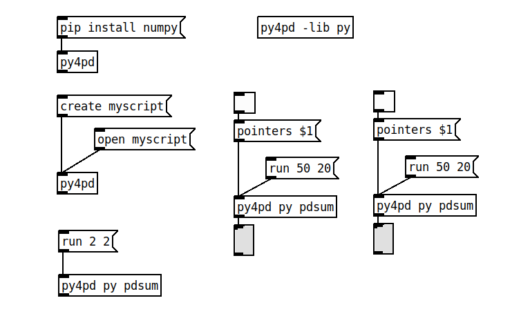

# `py4pd` Object

This section describes how the `py4pd` objects work in PureData environment. I split the content into two parts, one for arguments other for methods. I recommend reading the sections on arguments first then the section about the methods. 

    

-   :fontawesome-solid-gear: __py4pd Library__

    [:octicons-arrow-right-24: Library](py4pd-module.md)

    

-   :fontawesome-solid-gear: __Arguments__

    [:octicons-arrow-right-24: Arguments](args.md)

-   :fontawesome-solid-lightbulb: __Methods__

    [:octicons-arrow-right-24: Methods](methods.md)
    

