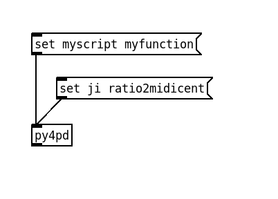
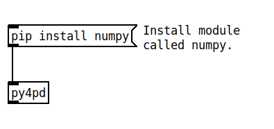
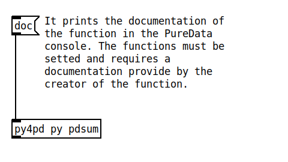
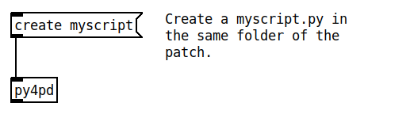
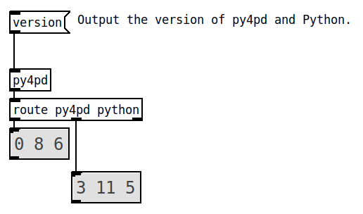

# <h2 align="center"> **Methods** </h2>

Next, I present all methods used in `py4pd` object. The methods are messages that you can send to the object. The methods are:

- :my-icons-pd: __[set](#set)__
    
    It loads the `Python` function.
   
- :my-icons-pd: __[pip](#pip)__
    
    To install packages. `pip install` install packages, `pip target` which folder install the packages.

- :my-icons-pd: __[run](#run)__

    It runs the `Python` function.

- :my-icons-pd: __[pointers](#pointers)__
    
    On/Off the Python Data output.

- :my-icons-pd: __[doc](#doc)__

    Print the documentation of the `Python` function.

- :my-icons-pd: __[open](#open)__

    Open a loaded script.

- :my-icons-pd: __[editor](#editor)__

    Set the editor to open Python Scripts.

- :my-icons-pd: __[create](#create)__

    Create a new `.py` script.

- :my-icons-pd: __[functions](#functions)__

    Print all the functions inside a script.

- :my-icons-pd: __[reload](#reload)__

    Reload the Python Function.

- :my-icons-pd: __[home](#home)__

    Set the Python Home folder.

- :my-icons-pd: __[packages](#packages)__

    Set the Python Packages folder (where Python searches for Packages).

- :my-icons-pd: __[version](#version)__

    Print the Version of `py4pd` and Python.

---

### <h3 align="center"><code>set</code></h3>

_Set the function for the object._

-   :fontawesome-solid-gear: __Arguments__

    ---
     | Parameters     | Type | Description                   |
    | :-----------: | :----: | :------------------------------: |
    | `arg1`   | `symbol` | Python Script name (never uses |
    | `arg2`   | `anything` | Args for the function |
   
-   :my-icons-pd: __Example__

    

        
    

    ??? tip "Tip"
        If you will always use the same function, you can create the object with the `py4pd script function`.

---

### <h3 align="center"> <code>pip</code> </h3>

When you `set` some function and see some error related to `ModuleNotFoundError:` No module named some module`, you` need to use `pip` to install this module.

-   :fontawesome-solid-gear: __Arguments__

    ---
     | Parameters     | Type | Description                   |
    | :-----------: | :----: | :------------------------------: |
    | `arg1`   | `symbol` | must be `install` |
    | `arg2`   | `modulename` | Module name to install |

    ??? note
        You can also use `pip target` to change the folder where `py4pd` will install the modules. `pip target local` will install the modules inside the patch folder. `pip install global` will install in the py4pd folder. Global installations are the default.
        
-   :my-icons-pd: __Example__

    

        
    

---

### <h3 align="center"> <code>run</code> </h3>

_Used to run the Python Functions._

-   :fontawesome-solid-gear: __Arguments__

    ---
    | Parameters     | Type | Description                   |
    | :-----------: | :----: | :------------------------------: |
    | `Arguments`   | `anything` | Arguments for the function |
    

-   :my-icons-pd: __Example__

    

        
    

---

### <h3 align="center"> <code>pointers</code> </h3>

You can work with Python Data types inside PureData. With this, you can work with any data type provided by Python inside PureData.

-   :fontawesome-solid-gear: __Arguments__

    ---
    | Parameters     | Type | Description                   |
    | :-----------: | :----: | :------------------------------: |
    | `on/off`   | `1` or `0` | `1` for on `0` for off |
    

-   :my-icons-pd: __Example__

    

        
    

---

### <h3 align="center"> <code>doc</code> </h3>

It prints on PureData the documentation of the Python Function (if it exists).

-   :fontawesome-solid-gear: __Arguments__

    ---

    

        There is no Arguments.
    

    !!! note
        
        The creator of the function must provide some documentation.

-   :my-icons-pd: __Example__

    

        
    

---

### <h3 align="center"> <code>open</code> </h3>

It opens `py` script files, in case the file does not exist in the patch folder, it creates a new Python Script. `open score`, for example, will open the `score.py` (if it exists) or create `score.py`.

-   :fontawesome-solid-gear: __Arguments__

    ---

    | Parameters     | Type | Description                   |
    | :-----------: | :----: | :------------------------------: |
    | `args`   | `symbol` | script file name **without** extension `.py`. |

-   :my-icons-pd: __Example__

    

        
    

---

### <h3 align="center"> <code>create</code> </h3>

It creates a new script in the patch folder.

-   :fontawesome-solid-gear: __Arguments__

    ---

    | Parameters     | Type | Description                   |
    | :-----------: | :----: | :------------------------------: |
    | `args`   | `symbol` | script file name **without** extension `.py`. |

-   :my-icons-pd: __Example__

    

        
    

---
### <h3 align="center"> <code>editor</code> </h3>

Without arguments, it opens the Python Script loaded with the message `set`. With one symbol args, you can choose between four IDE: `vscode`, `nvim, `emacs`, or `sublime`. The function must be loaded first.

-   :fontawesome-solid-gear: __Arguments__

    ---

    | Parameters     | Type | Description                   |
    | :-----------: | :----: | :------------------------------: |
    | `arg1`   | `symbol` | `vscode`, `nvim`, `emacs` and `sublime`. |

-   :my-icons-pd: __Example__

    

        
    

    ??? tip "Tip"
        If a function is loaded, clicking on the object will open the loaded function too.

---

### <h3 align="center"> <code>reload</code> </h3>

If you are working on a Python Script and changing the code, you need to send this message to the `py4pd` for the changes to be loaded.

-   :fontawesome-solid-gear: __Arguments__

    

        There are no Arguments.
    

-   :my-icons-pd: __Example__

    

        
    

---

### <h3 align="center"> <code>home</code> </h3>

Set the home for Python. It is similar to executing Python from some specific folder. For example, when we use `cd Downloads` then `python myscript.py` in the same terminal.

-   :fontawesome-solid-gear: __Arguments__

    | Parameters     | Type | Description                   |
    | :-----------: | :----: | :------------------------------: |
    | `arg1`   | `symbol` | Folder that will be the `HOME` for Python Script. |

-   :my-icons-pd: __Example__

    

        
    

---

### <h3 align="center"> <code>packages</code> </h3>

Set the package path for Python. `py4pd` will look for external modules inside these folders. For example, if you have one virtual environment called `composition`` with miniconda, you can send `packages ~/miniconda3/envs/composition/lib/python3.11/site-packages` to use the installed packages.

-   :fontawesome-solid-gear: __Arguments__

    | Parameters     | Type | Description                   |
    | :-----------: | :----: | :------------------------------: |
    | `arg1`   | `symbol` | Folder that will be the `HOME` for Python packages. |

-   :my-icons-pd: __Example__

    

        
    

### <h3 align="center"> <code>version</code> </h3>

Output the version of the installed `py4pd` and the version of `Python`.

-   :fontawesome-solid-gear: __Arguments__

    There is no Arguments.

-   :my-icons-pd: __Example__

    

        
    

