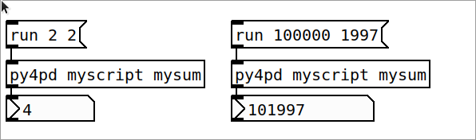
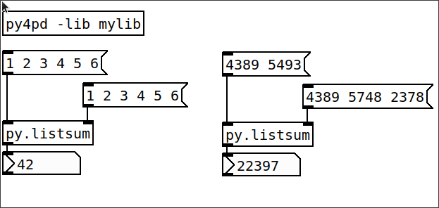

# How-To Projects

## Piece/Music Projects

* [Ideias Roubadas III (2024)](https://github.com/charlesneimog/Ideias-Roubadas-III): Piece where I use `py4pd` to convert svg to eletroacustic music.
* [Moteto (2024)](https://github.com/charlesneimog/Moteto): Piece where `py4pd` is used offline to render tests and the score.
* [Ecos (2023)](https://github.com/charlesneimog/Eco): Piece where using `py4pd` we create a server to generate images in real-time.

## Project 1 - Simple Script

Once you install Python and `py4pd`, the simple way to use Python inside PureData is by `.py` files. You must organize your work as

```
├─ PROJECT_FOLDER
├── myscript.py
└── mypatch.pd
```

Inside mscript.py you must define some Python function. Let's say:

``` py
def mysum(x, y):
    return x + y
```

After define the `mysum` function, you can load using `py4pd myscript mysum` (`[py4pd <script> <function>]`). To execute, send the message `run`, with the arguments (in this case two numbers).

<p align="center">
        
</p>

You can also use lists, to do that define some function with list:

``` py
def mylistsum(x):
    return sum(x)
```

And after that you can use `[py4pd myscript mylistsum]` to load the object and add the list using `[` and `]`. 

!!! warning
    We don't use `,` between the list items.


<p align="center">
        
</p>

## Project 2 - Simple Object

Using simple objects presented in Project 1 is fine for small projects, but for larger ones, you'll need arrays, lists, and other data structures to organize and run your code effectively. To use all the power of Python you can create PureData objects using Python, this is the main aim of `py4pd`. For that, organize your folder as this:

```
├─ PROJECT_FOLDER
├── mylib.py
└── mypatch.pd
```

Inside `mylib.py` you will create a function called `<script-name>_setup`, in this case, your function will be `mylib_setup()`. Inside this function you will use `add_object` to create a PureData object, the first argument is the function previously defined (the function itself not some string) and after a string with the PureData name of the object. For example:

``` py
import pd

def mysum(x, y):
    return x + y

def mylib_setup():
    pd.add_object(mysum, "py.sum")
```

After that you will load this function using `py4pd -lib mylib`. After load it, a new object called `py.sum` will be available.

<p align="center">
        
</p>
 
Note that, when we use `pd.add_object`, for each function parameters will be create an inlet. In the case below, to define `x` we use the left inlet, to define `y` we use the right inlet. 

``` py
import pd

def mylistsum(x, y):
    x_sum = sum(x)
    y_sum = sum(y)
    return x_sum + y_sum

def mylib_setup():
    pd.add_object(mylistsum, "py.listsum")
```

Because the automatic creation of inlets, we don't need to use brackets to use list, we can simple use PureData list, as showed below.

<p align="center">
        
</p>

## Project 3 - Complete Object

In our last project, the object's data type wasn't specified, meaning any input (number, word/symbol, or list) triggered the same function. However, sometimes we need different actions for different inputs. We can achieve this using the `new_object` function.

The `pd.new_object` function returns a class where we can define specific functions for numbers, symbols, or lists. Additionally, we can add custom methods (messages in Pd) to the object. This allows us to adapt the object's behavior to different types of input and create more specialized functionalities.

See for example the library `freesound`, in this library we want to be able to download sounds using the FreeSound api. For that, we need to create one object to search and download the sounds. But before that, we also need to be logged in the freesound account. Check how we create all these thing in one object.

``` py
def py4pdLoadObjects():
    # freesound
    pd_freesound = pd.new_object("freesound")
    pd_freesound.py_out = True
    pd_freesound.ignore_none = True

    # login
    pd_freesound.addmethod("set", set_login_var)
    pd_freesound.addmethod("oauth", initialize_oauth)
    pd_freesound.addmethod("login", login)

    # search
    pd_freesound.addmethod("target", target)
    pd_freesound.addmethod("filter", filter)
    pd_freesound.addmethod("query", query)
    pd_freesound.addmethod("search", search)
    pd_freesound.addmethod("clear", clear)  # clear all configs

    # get info and download
    pd_freesound.addmethod("get", get)
    pd_freesound.addmethod("download", download)

    pd_freesound.add_object()
```

In this object we have a lot of methods, some to do the login steps, anothers to search the audio, to get the info and download it. This is a basic work that can be done using the `pd.new_object` method. Check the help of the [py4pd-freesound](https://github.com/charlesneimog/py4pd-freesound) project to test this.

## Project 4 - Audio Analisys

Soon...

## Project 5 - Audio Synthesis

Soon...

## Project 6 - Audio Manipulation

Soon...
