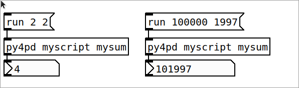
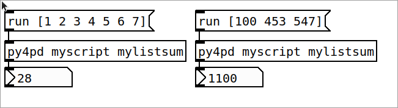

!!! danger "Nerd stuff"
    This is a section for people that run Python, check how to use the [`py4pd`](../pd-users/py4pd-module.md) library instead.
    
---

<div class="grid cards" markdown>

-   :simple-python: [__Hello World__](project1.md)
-   :simple-python: [__Simple Pd Object__](project2.md)
-   :simple-python: [__First Library__](project3.md)
-   :simple-python: [__Audio Processing__](project1.md)

</div>

# Project 1

Once you install Python and `py4pd`, the simple way to use Python inside PureData is by `.py` files. You must organize your work as

```
├─ PROJECT_FOLDER
├── myscript.py
└── mypatch.pd
```

Inside mscript.py you must define some Python function. Let's say:

``` py
def mysum(x, y):
    return x + y
```

After define the `mysum` function, you can load using `py4pd myscript mysum` (`[py4pd <script> <function>]`). To execute, send the message `run`, with the arguments (in this case two numbers).

<p align="center">
        
</p>

You can also use lists, to do that define some function with list:

``` py
def mylistsum(x):
    return sum(x)
```

And after that you can use `[py4pd myscript mylistsum]` to load the object and add the list using `[` and `]`. 

!!! warning
    We don't use `,` between the list items.


<p align="center">
        
</p>
