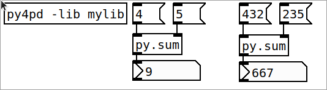
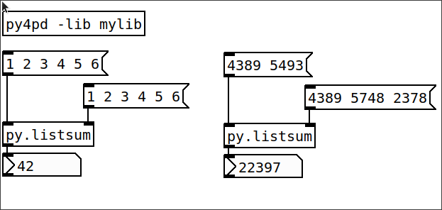

Using simple objects presented in Project 1 is fine for small projects, but for larger ones, you'll need arrays, lists, and other data structures to organize and run your code effectively. To use all the power of Python you can create PureData objects using Python, this is the main aim of `py4pd`. For that, organize your folder as this:

```
├─ PROJECT_FOLDER
├── mylib.py
└── mypatch.pd
```

Inside `mylib.py` you will create a function called `<script-name>_setup`, in this case, your function will be `mylib_setup()`. Inside this function you will use `add_object` to create a PureData object, the first argument is the function previously defined (the function itself not some string) and after a string with the PureData name of the object. For example:

``` py
import pd

def mysum(x, y):
    return x + y

def mylib_setup():
    pd.add_object(mysum, "py.sum")
```

After that you will load this function using `py4pd -lib mylib`. After load it, a new object called `py.sum` will be available.

<p align="center">
        
</p>
 
Note that, when we use `pd.add_object`, for each function parameters will be create an inlet. In the case below, to define `x` we use the left inlet, to define `y` we use the right inlet. 

``` py
import pd

def mylistsum(x, y):
    x_sum = sum(x)
    y_sum = sum(y)
    return x_sum + y_sum

def mylib_setup():
    pd.add_object(mylistsum, "py.listsum")
```

Because the automatic creation of inlets, we don't need to use brackets to use list, we can simple use PureData list, as showed below.

<p align="center" style="border-radius: 10px;">
        
</p>

