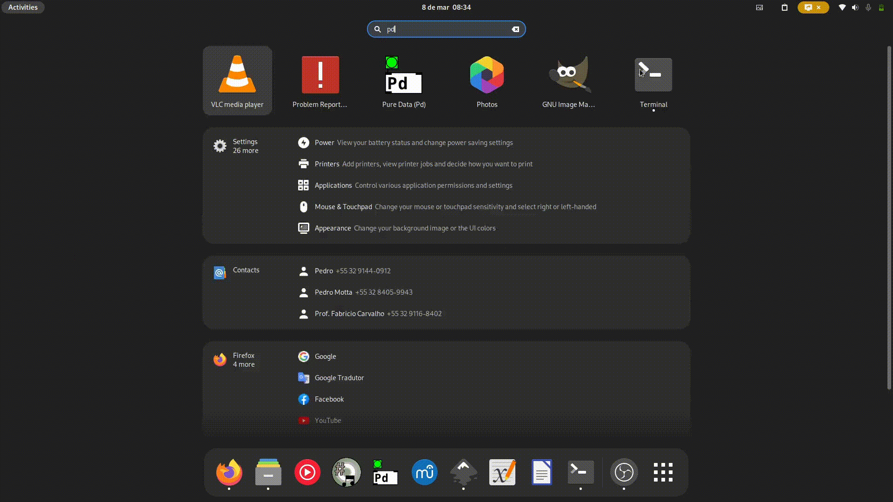

---
hide:
  - toc
  - navigation
---
# <h2 align="center"> **First Install `Python`** </h2>

---

=== ":material-apple: macOS"

    On `MacOS` you can install Python as an ordinary software.

    * Go to [Python.org](https://www.python.org/downloads/release/python-3127/),
    * Go to the bottom of the page and download: `macOS 64-bit universal2 installer`.
    * Install it as an ordinary program.

=== ":fontawesome-brands-windows: Windows"

    On `Windows` you can install Python as an ordinary software.

    * Go to [Python.org](https://www.python.org/downloads/release/python-3127/),
    * Go to the bottom of the page and download: `Windows installer (64-bit)`.
    * Install it as an ordinary program.

=== ":material-linux: Linux"

    !!! danger "Be careful of conflicts with numpy installed on the system"
        Sometimes, if numpy is already installed on your system (with the same version), `py4pd` may not work. This is a known limitation, and I haven't found a solution for it yet besides **uninstall numpy from the system**. Be carefull.

    On `Linux`:

    * Open the terminal.
    * Run:
        * :simple-fedora: `sudo dnf install python3.12 python3-pip`
        * :material-ubuntu: `sudo apt install python3.12 python3-pip`
        * :material-arch: `sudo yay -S python312 python3.pip`

--- 
# <h2 align="center"> **After Install `py4pd`** </h2>

1. Open PureData,
2. Go to `Help->Find Externals->`,
3. Search for `py4pd`,
4. Select py4pd and click on `Install`:

<figure markdown>
  { width="700" loading="lazy"  style="border-radius: 3px; box-shadow: 0px 8px 8px rgba(0, 0, 0, 0.2);"}
  <figcaption>Process of install py4pd on PureData</figcaption>
</figure>

# <h2 align="center"> **Extra Info** </h2>

To use `py4pd`, besides PureData, you *always* need to install Python and the package `py4pd`. I recommend to install Python first then the `py4pd` package.

!!! warning
    Always use the right version of Python as showed in the table.
    
    
     <table class="special-table" style="width: 100%" align="center">
            <thead>
              <tr>
                <th>Py4pd Version</th>
                <th>Python Version</th>
              </tr>
            </thead>
              <tbody>
              <tr>
                <td><code>0.9.0</code></td>
                <td>Python 3.12</td>
              </tr>
            </tbody>
            <tbody>
              <tr>
                <td><code>0.8.0</code></td>
                <td>Python 3.11</td>
              </tr>
            </tbody>
            <tbody>
              <tr>
                <td><code>0.7.0</code></td>
                <td>Python 3.10</td>
              </tr>
            </tbody>
        </table>

!!! info
    I have decided to always use one version below the current Python release. So, if the current Python version is `3.48`, `py4pd` will use Python version `3.47`. You can find additional releases of `py4pd` on GitHub: [https://github.com/charlesneimog/py4pd](https://github.com/charlesneimog/py4pd).
