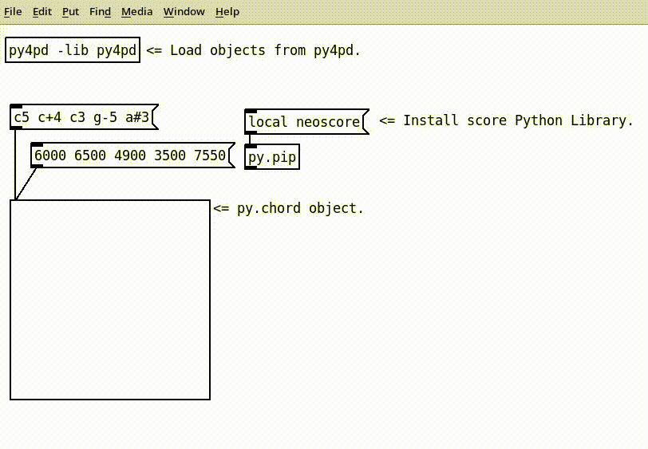
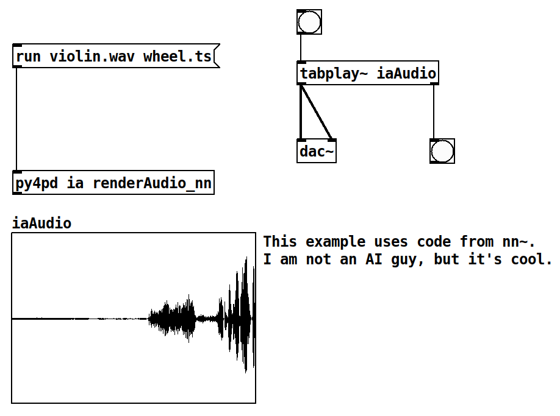

# Home

Welcome to the `py4pd` documentation! 

!!! warning "Incomplete Docs"

	<h3 align="center">I am writing the documentation yet, if you see some mistake, let me know.</h3>


`py4pd` allows the use of Python within PureData. It has the same goal as [py/pyext](https://github.com/grrrr/py), being simpler to keep up to date, use modules, use lists, and other things. With Python you can:

* Use scores inside PureData;
* Work with AI;
* Audio analisys;
* Use svg/draws as scores;
* OpenMusic functions in libraries like `om_py`, `music21`, `neoscore`, and others;

<hr>

## Quick Examples

In this section, I share examples of techniques and tools I use in my work as a composer. These examples are taken from my own pieces (sometimes pieces in developing) and represent different ways of approaching musical composition using `py4pd`, but it is *important* to emphasize that the Python code used here are basically copy and paste of Github Repositories under GPL and Common Creatives Licenses.

Through the sharing of these examples, my intention is to showcase the significant benefits that can be achieved with the use of Python and `py4pd` in PureData. Despite the creation of Python Scripts could be a challenging task, mainly for people not familiar with textual languages, Python provides a more accessible and user-friendly alternative to the programming languages of `C` and `C++`. Also, most musicians and researchers do/share their research work in Python, so copying and pasting code samples becomes a very common approach.

<hr>

### <h3 align="center"> **Score in PureData** </h3>

For certain musicians that use PureData, they might find that the Score visualization is a missing feature. However, this issue can be resolved by utilizing `py4pd`. This script is delivered along with the `py4pd` library.

<p align="center">
    
</p>

<hr>

### <h3 align="center"> **Artificial Inteligence** </h3>

It is easy use `AI` with `py4pd`. There already great objects, like `nn~` and `ddsp~`, but it requires some knowledge in how to compile it. For Windows, this can be problematic. Below we have an example using `py4pd` and the Python code used by `nn~`. 

<p align="center">
	</img>
</p>

<p align="center">
	<audio controls style="width: 60%; border-radius: 10px;"
	  <source src="examples/ia/turvo-wheel.wav" type="audio/mpeg">
	  Your browser does not support the audio element.
	</audio>
</p>


??? example end "Python Code"

    To illustrate the statement "Python offers a more accessible and user-friendly alternative that C and C++", presented earlier, here is an example of Python code: 
    
	``` py 

	import pd # py4pd library
	import torch # Library of AI
	import librosa # Library to load audios in Python

	def renderAudio_nn(audio, model):
	    model = pd.home() + '/' + model # get the pathname of model.ts, that is the result of the IA trained.
	    audio = pd.home() + '/' +  audio # The audio source
	    torch.set_grad_enabled(False) # config of the IA
	    model = torch.jit.load(model).eval() # Load model of IA
	    x = librosa.load(audio)[0] # take the audio samples of the sound (audio)
	    x_for = torch.from_numpy(x).reshape(1, 1, -1) # transform the audio to fit in the IA model
	    z = model.encode(x_for) # tranlate for the IA thing, I believe here is the black box.
	    z[:, 0] += torch.linspace(-2, 2, z.shape[-1]) # No ideia;
	    y = model.decode(z).numpy().reshape(-1) # Now we have sound again!
	    pd.tabwrite('iaAudio', y.tolist(), resize=True) # Here we write the sound in the table 'iaAudio'.
	    pd.print('Audio rendered')

	```

<hr>
### <h3 align="center"> **Draws as scores** </h3>

In this example, I am using the `svg` file shown above to render sounds using the new `else/plaits~`. Besides `earplug~`, and `cyclone/coll`. The colors control the `plaits~` parameters.

<p align="center">
	</img>
</p>

<p align="center">
	<audio controls style="width: 60%; border-radius: 10px;"
	  <source src="examples/img2sound/img2sound.mp3" type="audio/mpeg">
	  Your browser does not support the audio element.
	</audio>
</p>

<hr>

### <h3 align="center"> **Spectral analysis** </h3>

In Python, there is not just one Spectral Analysis package, but a lot. I like mainly `loristrck`. But there is `simpl`, `librosa`, [PyAudio_FFT](https://github.com/aiXander/Realtime_PyAudio_FFT), among others. For people that work with `.sdif` files there is `pysdif3` that is fast an amazing. Here an example using `loristrck` in PureData.

_Here I will put I amazing print_ 

<hr>

### <h3 align="center"> **Eco (2023)** </h3>

Eco (2023) is the first version of one under developing piece that use some concepts of the composer Ricardo Thomasi in his PhD research. The idea here, is to use smartphones/tablets putted in the performance music stand, to make realtime `FFT` and `Partial Tracking` and then, generate scores that are played. The smartphones/tablets send data to PureData, and using `py4pd`, we generate realtime scores using `neoscore`.

<hr>
### 


