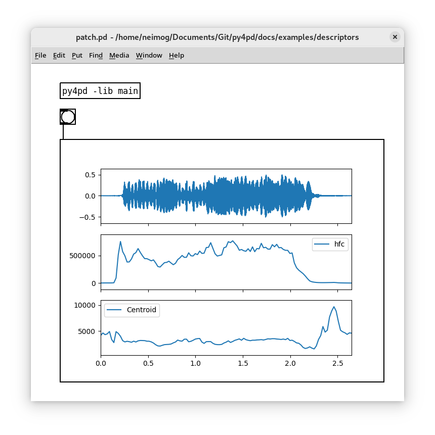

---
hide:
  - navigation
  - toc
---

# Introduction

<p align="center"> Welcome to the <code>py4pd</code> documentation! </p>

<p align="center">
    
</p>

## <h2 align="center"> **What is py4pd?** </h2>

---

`py4pd` integrates the power of [Python](https://www.python.org/) into the real-time environment of [PureData](https://puredata.info/). Besides providing means for score visualization, AI integration, audio analysis tools, SVG/drawing score handling, and various other functionalities, <u><i>you can create PureData Objects using Python</i></u>. If you use [OpenMusic](https://openmusic-project.github.io/openmusic/) or [BachLibrary](https://www.bachproject.net/), you will find some inspiration in it.

!!! info "How to install?"

    To check how to install go to [Installation](https://www.charlesneimog.com/py4pd/setup/).

<hr>
## <h2 align="center"> **Examples and Use Cases** </h2>

Here are presented tools implemented with `py4pd`. <i>Users are encouraged to contribute their examples through [Github](https://github.com/charlesneimog/py4pd/discussions/categories/show-and-tell) </i>.

=== "Score In PureData"

    When I started work with PureData, I missed score visualization tools. `py4pd` can easily solve this using `neoscore`.

    <p align="center">
        
    </p>

=== "Artificial Inteligence"

    It is easy to use `AI` with `py4pd`. There are already powerful objects for realtime, like `nn~` and `ddsp~`, but they are designed to specify approaches. Below is an example using `py4pd` and the Python code used by `nn~` (offline processing).

    <p align="center">
        </img>
    </p>

    <p align="center">
        <audio controls style="width: 60%; border-radius: 10px;">
            <source src="./examples/ia/turvo-wheel.wav" type="audio/mpeg">
            Your browser does not support the audio element.
        </audio>
    </p>

    ??? example end "Python Code"

        To illustrate the statement "Python offers a more accessible and user-friendly alternative that C and C++", presented earlier, here is an example of Python code:

        ``` py

        import pd # py4pd library
        import torch # Library of AI
        import librosa # Library to load audios in Python

        def renderAudio_nn(audio, model):
            model = pd.get_patch_dir() + '/' + model # get the pathname of model.ts, that is the result of the IA trained.
            audio = pd.get_patch_dir() + '/' +  audio # The audio source
            torch.set_grad_enabled(False) # config of the IA
            model = torch.jit.load(model).eval() # Load model of IA
            x = librosa.load(audio)[0] # take the audio samples of the sound (audio)
            x_for = torch.from_numpy(x).reshape(1, 1, -1) # transform the audio to fit in the IA model
            z = model.encode(x_for) # tranlate for the IA thing, I believe here is the black box.
            z[:, 0] += torch.linspace(-2, 2, z.shape[-1]) # No idea;
            y = model.decode(z).numpy().reshape(-1) # Now we have sound again!
            pd.tabwrite('iaAudio', y.tolist(), resize=True) # Here we write the sound in the table 'iaAudio'.
            pd.print('Audio rendered')

        ```

=== "Draws as scores"

    In this example, I use the SVG file above to render sounds using the new `else/plaits~`. Besides `earplug~`, and `cyclone/coll`. The colors control the `plaits~` parameters.


    <p align="center">
        </img>
    </p>

    <p align="center">
        <audio controls style="width: 60%; border-radius: 10px;">
            <source src="examples/img2sound/img2sound.mp3" type="audio/mpeg">
            Your browser does not support the audio element.
        </audio>
    </p>

=== "Sound analysis"

    In Python, there is not just one Spectral Analysis package. I mainly use `loristrck` because of the `.sdif` files. But there is `simpl`, `librosa`, [PyAudio_FFT](https://github.com/aiXander/Realtime_PyAudio_FFT), among others. If you want spectral manipulations you can work with `pysdif3` which is fast and amazing. Here is an example using `loristrck` in PureData.

    <p align="center">
        </img>
    </p>

=== "Audio Descriptors Graphs"

    You can use some of the Audio Descriptors provided by `audioflux` for some analysis.

    <p align="center">
        </img>
    </p>

---

### <h3 align="center"> **Pieces** </h3>

=== "Eco (2023)"

    Eco (2023) is the first version of one under developing piece that use some concepts of the composer Ricardo Thomasi in his PhD research. The idea here, is to use smartphones/tablets putted in the performance music stand, to make realtime `FFT` and `Partial Tracking` and then, generate scores that are played. The smartphones/tablets send data to PureData, and using `py4pd`, we generate realtime scores using `neoscore`.

    <p align="center">
        <iframe style="border-radius: 5px" width="560" height="315" src="https://www.youtube.com/embed/XIEI7-W7t2o" title="YouTube video player" frameborder="0" allow="accelerometer; autoplay; clipboard-write; encrypted-media; gyroscope; picture-in-picture; web-share" allowfullscreen></iframe>
    </p>

=== "Moteto (2023)"

    The piece Moteto aims to be a rereading of medieval motet. In addition, to overlapping independent voices, we use Just Intonation structures. With the help of technology, I aim to make the piece playable, also by amateur choirs, it is available in this website: www.charlesneimog.com/moteto/.
    <p align="center">
        <iframe style="border-radius: 5px" width="560" height="315" src="https://www.youtube.com/embed/TVcHzLCmpDM?si=GIkYPPifzjhfFZvM" title="YouTube video player" frameborder="0" allow="accelerometer; autoplay; clipboard-write; encrypted-media; gyroscope; picture-in-picture; web-share" allowfullscreen></iframe>
    </p>
