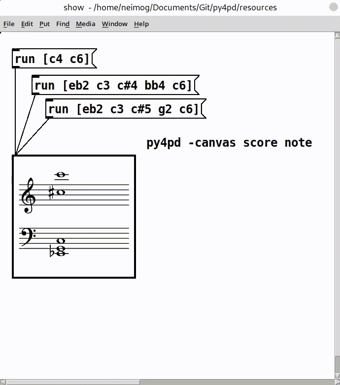
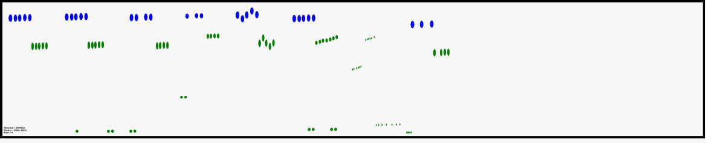

# Home

Welcome to the `py4pd` documentation! I am writing this yet, and some things are incomplete.

`py4pd` allows the use of Python within PureData. It has the same goal as [py/pyext](https://github.com/grrrr/py), being simpler to keep up to date, use modules, use lists, and other things. With Python you can:

* Work with AI;
* Audio analisys;
* Use scores inside PureData;
* Use svg/draws as scores;
* OpenMusic functions in libraries like `om_py`, `music21`, `neoscore`, and others;

## Quick Examples

Here I will present some examples that I am using in my pieces.  

### **Artificial Inteligence**

I will write the doc soon.

### **Score in PureData** 

    

### **Draws as scores**

	</img>

	<audio controls>
	  <source src="assets/examples/img2sound/img2sound.mp3" type="audio/mpeg">
	  Your browser does not support the audio element.
	</audio>

### **Spectral analysis**

I will write the doc soon.

### **Eco (2023)**

I will write the doc soon.

### 

