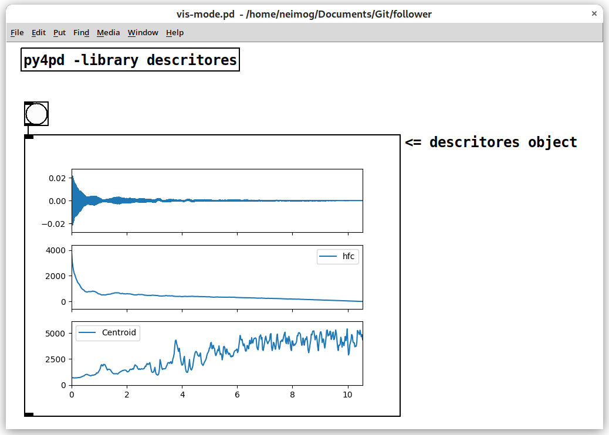

# Introduction

## <h2 align="center"> **What is py4pd?** </h2>


Welcome to the py4pd documentation!

py4pd enables the integration of [Python](https://www.python.org/) as an object in [PureData](https://puredata.info/), providing a simpler and more up-to-date alternative to [py/pyext](https://github.com/grrrr/py). With py4pd, you can take advantage of Python's features such as modules, lists, and more.

The primary focus of py4pd is to allow the use of Python for writing PureData objects, bringing the possibilities of OpenMusic and OM-Sharp into the real-time environment. This opens up a world of opportunities, including visualizing scores within PureData, utilizing AI capabilities, leveraging various audio analysis tools, working with SVG/draws as scores, and much more.

To check how to install go to [Installation](https://www.charlesneimog.com/py4pd/setup/).

<hr>

## <h2 align="center"> **Examples and Use Cases** </h2>

In this section, I share examples of techniques and tools I use in my composition pieces/research. It represents different ways of approaching musical composition using `py4pd`. It is important to emphasize that the Python code uses copies of Github codes under GPL and Common Creatives Licenses.

By sharing these examples, I intend to showcase the significant benefits that can be achieved with the use of Python and `py4pd` in PureData. Although creating Python Scripts could be challenging, mainly for people unfamiliar with textual languages, Python provides a more accessible and user-friendly alternative to the programming languages of `C` and `C++`. Also, most music researchers do/share their research in Python, so copying and pasting code samples becomes a common approach.

<hr>

### <h3 align="center"> **Score in PureData** </h3>

Specific musicians using PureData might find that the Score visualization is missing. This issue can be resolved by utilizing `py4pd`. This script is delivered along with the `py4pd` library.

<p align="center">
    
</p>

<hr>

### <h3 align="center"> **Artificial Inteligence** </h3>

It is easy to use `AI` with `py4pd`. There are already powerful objects for realtime, like `nn~` and `ddsp~`, but it requires some knowledge of how to compile them. For Windows, this can be problematic. Below is an example using `py4pd` and the Python code used by `nn~` (offline processing).

<p align="center">
	</img>
</p>

<p align="center">
	<audio controls style="width: 60%; border-radius: 10px;"
	  <source src="examples/ia/turvo-wheel.wav" type="audio/mpeg">
	  Your browser does not support the audio element.
	</audio>
</p>


??? example end "Python Code"

    To illustrate the statement "Python offers a more accessible and user-friendly alternative that C and C++", presented earlier, here is an example of Python code: 
    
	``` py 

	import pd # py4pd library
	import torch # Library of AI
	import librosa # Library to load audios in Python

	def renderAudio_nn(audio, model):
	    model = pd.home() + '/' + model # get the pathname of model.ts, that is the result of the IA trained.
	    audio = pd.home() + '/' +  audio # The audio source
	    torch.set_grad_enabled(False) # config of the IA
	    model = torch.jit.load(model).eval() # Load model of IA
	    x = librosa.load(audio)[0] # take the audio samples of the sound (audio)
	    x_for = torch.from_numpy(x).reshape(1, 1, -1) # transform the audio to fit in the IA model
	    z = model.encode(x_for) # tranlate for the IA thing, I believe here is the black box.
	    z[:, 0] += torch.linspace(-2, 2, z.shape[-1]) # No ideia;
	    y = model.decode(z).numpy().reshape(-1) # Now we have sound again!
	    pd.tabwrite('iaAudio', y.tolist(), resize=True) # Here we write the sound in the table 'iaAudio'.
	    pd.print('Audio rendered')

	```

<hr>
### <h3 align="center"> **Draws as scores** </h3>

In this example, I use the SVG file above to render sounds using the new `else/plaits~`. Besides `earplug~`, and `cyclone/coll`. The colors control the `plaits~` parameters.


<p align="center">
	</img>
</p>

<p align="center">
	<audio controls style="width: 60%; border-radius: 10px;"
	  <source src="examples/img2sound/img2sound.mp3" type="audio/mpeg">
	  Your browser does not support the audio element.
	</audio>
</p>

<hr>

### <h3 align="center"> **Spectral analysis** </h3>

In Python, there is not just one Spectral Analysis package, but a lot. I like mainly `loristrck`. But there is `simpl`, `librosa`, [PyAudio_FFT](https://github.com/aiXander/Realtime_PyAudio_FFT), among others. For people that work with `.sdif` files there is `pysdif3` that is fast an amazing. Here an example using `loristrck` in PureData.

_Here I will put I amazing print_ 

<hr>

### <h3 align="center"> **Audio Descriptors Graphs** </h3>

PureData provides a rich set of audio descriptors that offer versatile means for musical expression. In the context of music composition, descriptor contours can be a valuable resource for creating and controlling various musical parameters. In this example I use `audioflux` as a tool for visualizing the contours of audio descriptors in the composition process.

<p align="center">
	</img>
</p>

<hr>

## <h2 align="center"><b>My own Pieces</b></h2>

Here I will present some of the works where I am using `py4pd`.

<hr>

### <h3 align="center"> **Eco (2023)** </h3>

Eco (2023) is the first version of one under developing piece that use some concepts of the composer Ricardo Thomasi in his PhD research. The idea here, is to use smartphones/tablets putted in the performance music stand, to make realtime `FFT` and `Partial Tracking` and then, generate scores that are played. The smartphones/tablets send data to PureData, and using `py4pd`, we generate realtime scores using `neoscore`.

  <iframe align="center" width="560" height="315" src="https://www.youtube.com/watch?v=XIEI7-W7t2o" frameborder="0" allowfullscreen></iframe>

<hr>

### <h3 align="center"> **Moteto (2023)** </h3>

The piece Moteto aims to be a rereading medieval motet. In addition, to overlapping independent voices, we use Just Intonation structures. With the help of technology, I aim to make the piece playable, also by amateur choirs, it is available in this website: www.charlesneimog.com/moteto/.

<hr>
### 


