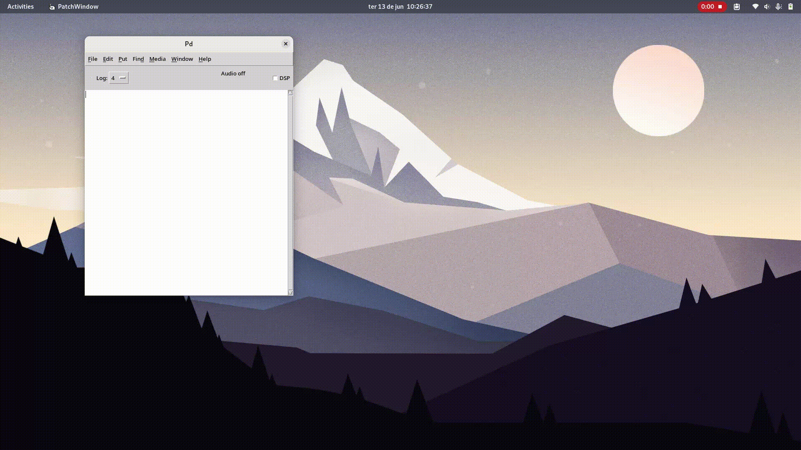

# External Libraries

`py4pd` libraries contain extra tools dedicated to specific purposes. 

You can download the libraries using `deken`. To install the library search for the library name.

??? info "Gif of installation process"

    <figure markdown>
      { width="1000" loading="lazy"}
      <figcaption>Process of install pd-ji on PureData</figcaption>
    </figure>

--------------------------

### <h3 style="text-align:center"> **List of Libraries** </h3>

<table class="special-table">
    <thead>
      <tr>
        <th>Library Name</th>
        <th>Description</th>
        <th>Author</th>
      </tr>
    </thead>
    <tbody>
      <tr>
        <td><a href="https://github.com/charlesneimog/pd-ji">pd-ji</a></td>
        <td>It creates an environment for the microtonal music composition, mainly for Just Intonation composition.</td>
        <td><a href="https://www.charlesneimog.com/"</a> Charles K. Neimog</td>
      </tr>
    </tbody>
    <tbody>
      <tr>
        <td><a href="https://github.com/charlesneimog/orchidea">orchidea</a></td>
        <td>It allows loading <a href="https://forum.ircam.fr/projects/detail/orchideasol/">Orchidea</a> samples using midi inputs.</td>
        <td><a href="https://www.charlesneimog.com/"</a> Charles K. Neimog</td>
      </tr>
    </tbody>
  </table>
  
