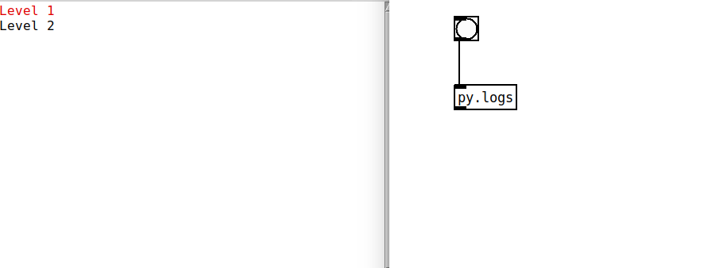
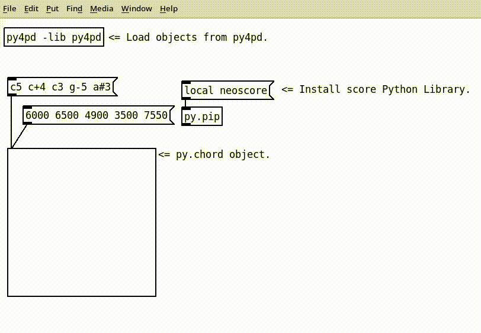

# Python Embedded Module

If you're using [Python](https://www.python.org/) and [PureData](https://puredata.info/) together, you can use the `pd` module within the `py4pd` package to exchange data, set configurations, inform users of errors, and use all Python things. The module is embedded in the `py4pd` code and is only accessible within the `py4pd` environment. It's similar to how Google Collab uses modules like `google.collab.drive` and `google.collab.widgets`. In the next section I present all the methods that are embedded.

--------------
## <h2 style="text-align:center">**Write Pd Objects with Python**</h2>
--------------

With the `py4pd` it is possible to create new PureData objects using just Python. For that, you need to declare your Python functions and then create a function called `libraryname_setup`. Inside this function we use `pd.add_object` (check the [docs](https://www.charlesneimog.com/py4pd/python-users/#pdaddobject)) to add all functions that you want to use as objects. 

<p style="text-align:center"><i>The organization of folders in the library should follow the following standard.</i></p>


!!! info "Folder Organization"
    The folder name must be the same the the `.py` file. In your case, it must be called `libraryname`.
    
        └── help-patches/
            ├── myfunction1-help.pd # helpPatches
            └── myfunction2-help.pd 
        └── src/
            ├── setoffunctions1.py # you can organize/name this folder as you want, this is just one example.
            └── setoffunctions2.py

        └── resources/
            ├── imagetosomeVISobject.png # for pd.VIS objects, you can set standard images of png or gif.
            └── imagetootherVISobject.gif
        ├── libraryname.py # here we have the libraryname_setup() function
        ├── README.deken.pd # If you upload it on Deken, this will open immediately after installation (good to install things).
        └── README.md # Ordinary readme for Github.

See the some libraries organization in [orchidea](https://github.com/charlesneimog/orchidea?search=1).

---------------------------

See the Python Code:

``` py title="libraryname.py"

import pd
from src.setoffunctions1 import myfunction1
from src.setoffunctions2 import myfunction2
from src.setoffunctions2 import showmycollgraph


def libraryname_setup():
    pd.add_object(myfunction1, "mysumObject") # function, string with name of the object
    pd.add_object(myfunction2, "mysumObject2") # function, string with name of the object
    pd.add_object(showmycollgraph, "graph", objtype=pd.VIS, objimage="./resources/imagetosomeVISobject.png")
```

<p align="center">
    Following this steps we have this patch:
    
</p>


--------------------
### <h3 style="text-align:center"> **Types of Objects** </h3>
--------------------

In the example above, we create ordinary objects. With `py4pd`, we can create five types of objects: 

=== "Ordinary Objects" 

    Used to create functions like sum numbers, convertion between datas (svg to scores, for example), etc.
    
=== "Visualization Objects" 

    Used to create functions to show something. Like Scores, Audio descriptors, and others.
    
    To create vis object, in `pd.add_object` we add the `objtype=pd.VIS`. Inside the function, we always need the `pd.show_image` method, without it, anything will be showed. 
    For `pd.VIS` objects, we have some options in `pd.add_object`.

    * `figsize`: It set the size of the figure that will be showed, this is more for aesthetic reasons (the figure will always be resized).

    See the example:

    ??? example end "Python Code"
        ```py 

        import pd
        import audioflux as af
        import matplotlib.pyplot as plt
        from audioflux.display import fill_plot, fill_wave
        from audioflux.type import SpectralFilterBankScaleType, SpectralDataType
        import numpy as np

        def descriptors():
            audio_arr, sr = af.read(pd.get_home_folder() + "/Hp-ord-A4-mf-N-N.wav")
            bft_obj = af.BFT(num=2049, samplate=sr, radix2_exp=12, slide_length=1024,
                           data_type=SpectralDataType.MAG,
                           scale_type=SpectralFilterBankScaleType.LINEAR)
            spec_arr = bft_obj.bft(audio_arr)
            spec_arr = np.abs(spec_arr)
            spectral_obj = af.Spectral(num=bft_obj.num,
                                       fre_band_arr=bft_obj.get_fre_band_arr())
            n_time = spec_arr.shape[-1]  # Or use bft_obj.cal_time_length(audio_arr.shape[-1])
            spectral_obj.set_time_length(n_time)
            hfc_arr = spectral_obj.hfc(spec_arr)
            cen_arr = spectral_obj.centroid(spec_arr) 

            fig, ax = plt.subplots(nrows=3, sharex=True)
            fill_wave(audio_arr, samplate=sr, axes=ax[0])
            times = np.arange(0, len(hfc_arr)) * (bft_obj.slide_length / bft_obj.samplate)
            fill_plot(times, hfc_arr, axes=ax[1], label='hfc')
            fill_plot(times, cen_arr, axes=ax[2], label="Centroid")
            tempfile = pd.get_temp_dir() + "/descritores.png"
            plt.savefig(tempfile)
            pd.show_image(tempfile)
            pd.print("Data plotted")

        def libraryname_setup():
            pd.add_object(descriptors, "descritores", objtype=pd.VIS, figsize=(640, 480))
        ```
        
    <p align="center">
        
    </p>

=== "Audio In Objects"

    Used to output analised data from audio. Objects with Partial Trackings, Audio Descriptors, and others.
        
    To create Audio In object, in `pd.add_object` we add the `objtype=pd.AUDIOIN`. 

    !!! warning "The first inlet of this objects always need to be audio"

    <p align="center">
        
    </p>

    ??? example end "Python Code"
        ```py 

        import pd
        import numpy
        
        def audioin(audio):
            fft = numpy.fft.fft(audio)
            fft = numpy.real(fft) 
            return fft.tolist() # numpy can just be outputed when pyout=True

        def libraryname_setup():
            pd.add_object(audioin, "audioin", objtype=pd.AUDIOIN)
        ```

=== "Audio Out Objects" 

    Used to create audio using Python. Objects that creates sinusoids, some special noise and others.
        
    To create Audio out object, in `pd.add_object` we add the `objtype=pd.AUDIOOUT`. 

    <p align="center">
        
    </p>


    ??? example end "Python Code"
        ```py 

        import pd
        import numpy
        
        def audioin(audio):
            fft = numpy.fft.fft(audio)
            fft = numpy.real(fft) 
            return fft.tolist() # numpy can just be outputed when pyout=True

        def libraryname_setup():
            pd.add_object(audioin, "audioin", objtype=pd.AUDIOIN)
        ```
        
    
=== "Audio (in and out) Objects" 

    Used to manipulations of Audio. FFT, reverbs, and others. 
    
    To create Audio object (audio input and output), in `pd.add_object` we add the `objtype=pd.AUDIO`. 

    <p align="center">
        
    </p>


    ??? example end "Python Code"
        ```python

        import pd
        import numpy
        
        def audio(audio, amplitude):
            if amplitude is None:
                amplitude = 0.2
            audio = numpy.multiply(audio, amplitude)
            return audio


        def libraryname_setup():
            pd.add_object(audio, "audio", objtype=pd.AUDIO)
            
        ```

 
## <h2 style="text-align:center"> **Embbeded Module with `py4pd`** </h2>

--------------------
### <h3 style="text-align:center"> **Write PureData Objects** </h3>
--------------------

#### <h4 style="text-align:center"> `pd.add_object` </h4>

You can create your own objects with Python. For that, you define the Python Function and add it as an object using `#!python pd.add_object()`.

??? danger "Breaking Changes"
	I had change how `pd.add_object` work from version `0.6` to version `0.7`. Now, me use the function and the Pure Data object. Instead of use this, `pd.add_object("mysumObject", "NORMAL", "myNewPdObjects", "mysumObject")` we use this `pd.add_object(mysumObject, "mysumObject")`.

=== "Parameters"

    | Parameters     | Type | Description                   | 
    | :-----------: | :----: | :------------------------------: |
    | `arg1`   | `Python Function` | Function that will be executed by the object.  |
    | `arg2`   | `String` | String to create the object. |

=== "Keywords"

    | Keyword     | Type | Description                   | 
    | :-----------: | :----: | :------------------------------: |
    | `objtype`   | `pd` | The type of the object: `pd.VIS`, `pd.AUDIO`, `pd.AUDIOIN`, or `pd.AUDIOOUT`. Hiding this option will create a normal object.  |
    | `figsize`   | `Tuple` | Sets the pixel size of the object. Example: `figsize=(400, 200)` creates an object with a width of 400 and height of 200. |
    | `pyout`    | `Boolean` | Determines whether the output will be in PureData data types or Python data types. If set to Python, you can not use the data before the convertion to PureData with `py2pd` object. |
    | `no_outlet`    | `Boolean` | Creates an object with no outlets if set to `True`. |
    | `num_aux_outlets`| `int` | Set the number of auxiliar outlets. If you use 4, it means that the object will have 5 inlets, 4 auxiliar and the main outlet (0). |
    | `added2pd_info` | `Boolean` | Prints the message `"[py4pd]: Object {objectName} added."` when set to `True`. |
    | `helppatch` | `String` | Personalized help patch, it always must be inside the `help` folder. |
    | `ignore_none_return` | `Boolean` | When `True` it ignores all things that return None. |
    | `objimage` | `String` | Set the standard image for `pd.VIS` objects. When you create the object it will load this image. |


=== "Examples"

    ``` python

    pd.add_object(myFunction, "mypyobj", 
                objtype=pd.VIS, figsize=(400, 200), 
                pyout=True, no_outlet=False, added2pd_info=False)

    ```

    ``` py

    import pd


    def mysumObject(a, b, c, d):
        return a + b + c + d

    def libraryname_setup():
        pd.add_object(mysumObject, "mysumObject")

        # My License, Name and University, others information
        pd.print("", show_prefix=False)
        pd.print("GPL3 2023, Your Name", show_prefix=False)
        pd.print("University of São Paulo", show_prefix=False)
        pd.print("", show_prefix=False)

    ```

    Here we add the function `mysumObject` in PureData enviroment. For more infos read the [Python Objects](https://www.charlesneimog.com/py4pd/researchers/) page.

    <p align="center">
        
    </p>


-------------------------------------- 
### <h3 style="text-align:center"> **Exchanging Data** </h3>
--------------------------------------

These are the methods used to send data from Python to PureData. The inverse path is done mainly with `run` and `key` messages. 
<br>
--------------------------------------
#### <h4 id="pdout" style="text-align:center"> `pd.out` </h4>

`#!python pd.out()` allows you to output data to PureData without needing to wait for the Python function to finish executing. This is different from returning data to PureData using the `#!python return` statement, which requires the function to complete before sending data. 

=== "Parameters"

    | Parameters     | Type | Description                   | 
    | :-----------: | :----: | :------------------------------: |
    | `arg1`   | `Python Object` | Python thing that will be outputed. |

=== "Keywords"

    | Parameters     | Type | Description                   | 
    | :-----------: | :----: | :------------------------------: |
    | `symbol`   | `string` | It prepend the string in the output, can be used with `route` object. |


=== "Examples" 

    For example, consider the following function:

    ``` py
    import pd


    def example_pdout():
        for x in range(10):
        	pd.out(x, symbol="loop")
        pd.out("fim", symbol="end")

    ```

</p>

---------------------------

#### <h4 id="pdsend"  style="text-align:center"> `pd.send` </h4>

You can use `pd.send` to send data to a receive object in your PureData patch. This method takes in two arguments: the name of the `receive` object and the value you want to send. For instance, suppose you have a receive object named "myReceiver" in your patch. To send the value 42 to this object, you could use `pd.send("myReceiver", 42)`.

=== "Parameters" 

    | Parameters     | Type | Description                   | 
    | :-----------: | :----: | :------------------------------: |
    | `arg1`   | `string` | Name of the receive object. |
    | `arg2`   | `Python Object` | Data that will be sent. |

=== "Examples"

    ``` python
    import pd


    def pd.send():
        "It sends a message to the py4pdreceiver receive."	
	    pd.send("py4pdreceiver", "hello from python!")
	    pd.send("py4pdreceiver", 1) 
	    pd.send("py4pdreceiver", [1, 2, 3, 4, 5])
	    return 0

    ```

    In this example, it will send to `py4pdreceiver` the message `"hello from python!"`, then the number `1`, then the list `[1, 2, 3, 4, 5]`. 

-------------------------------------- 
#### <h4 id="pdtabwrite" style="text-align:center"> `pd.tabwrite` </h4>

`pd.tabwrite` is a method that is essentially a copy of the `tabwrite` object in PureData. With this method, you can write audio or any data supported to PureData array.

=== "Parameters"

    | Parameters     | Type | Description                   | 
    | :-----------: | :----: | :------------------------------: |
    | `arg1`   | `string` | Name of the table. |
    | `arg2`   | `Python Object` | List or array (numpy) of numbers. |

=== "Keywords"

    | Keyword     | Type | Description                   | 
    | :-----------: | :----: | :------------------------------: |
    | `rezise`   | `Boolean` | Set if the table will be resized or not. |

=== "Examples"

    ``` python

      pd.tabwrite("table2test", randomNumbers, resize=True)
      
    ```


-------------------------------------- 
#### <h4 id="pdtabread" style="text-align:center"> `pd.tabread` </h4>

`pd.tabread` is a method that is essentially a copy of the `tabread` object in PureData. With this method, you can read data from a PureData array directly from within your Python code. It will return one Numpy Array with the data of the table.

=== "Parameters"

    | Parameters | Type    | Description                  |
    | :--------: | :-----: | :--------------------------: |
    |   `arg1`   | `string`|    Name of the table.        |


=== "Examples" 

    ``` py
    import pd

    def readFromArray():
        valuesFromArray = pd.tabread("py4pdArray")
        return valuesFromArray # This code don't make any sense :), but you understand it.

    ```

------------------
### <h3 style="text-align:center"> **Info for the user** </h3>
--------------------

There are three messages used to print info in the PureData console, `pd.print`, `pd.logpost` and `pd.error`.
<br>

------------------
#### <h4 id="pdprint" style="text-align:center"> `pd.print` </h4>

The ordinary function `#!python print()` will not work in `py4pd` (unless that you open PureData from the terminal). So if you want to debug or print some info from the PureData console you need to use `#!python pd.print`. 


=== "Parameters" 

    | Parameters     | Type | Description                   | 
    | :-----------: | :----: | :------------------------------: |
    | `arg1`   | `Python Object` | Thing to print |

=== "Keywords" 

    | Parameters     | Type | Description                   | 
    | :-----------: | :----: | :------------------------------: |
    | `show_prefix`   | `Python Object` | When `False` it remove the string "[Python]" from the begin of the message | 

=== "Examples" 

    ``` py
    import pd
	    
    pd.print("ok") # It prints "[Python] ok"
    pd.print("ok", show_prefix=False) # It prints "ok".

    ```

------------------
#### <h4 style="text-align:center"> `pd.logpost` </h4>

This function uses `logpost` in C PureData API to log messages using levels. For example, if you use `#!python logpost(4, "PureData message in level 4")`, the message will appear in console just if the user had selected to show the messages of level 4 in PureData Console.

<p align="center">
    
</p>

=== "Parameters" 

    | Parameters     | Type | Description                   | 
    | :-----------: | :----: | :------------------------------: |
    | `arg1`   | `int` | Level to print (1-4) |
    | `arg2`   | `string` | Message to print |

=== "Examples" 

    ``` py
    import pd
	    
    pd.logpost(1, "Level 1") 
    pd.logpost(2, "Level 2") 
    pd.logpost(3, "Level 3") 
    pd.logpost(4, "Level 4") 

    ```


-------------------------------------- 

#### <h4 style="text-align:center"> `pd.error` </h4>

If you want to inform errors in PureData console use `pd.error` method. 


=== "Parameters"

    | Parameters     | Type | Description                   | 
    | :-----------: | :----: | :------------------------------: |
    | `arg1`   | `string` | Message of the error. |


=== "Examples" 

    ``` python
    import pd

    def main(arg1):
        if isinstance(arg1, list):
            for i in range(1, 10):
            
        try:
            # some wrong arg here ????
        
        except:
            pd.error("This is a not valid operation")

    ```

-------------------------------------- 
### <h3 style="text-align:center"> **Utilities** </h3>
--------------------------------------

#### <h4 style="text-align:center"> `pd.get_str_pointer` </h4>

When working with audio objects, there are situations where we require global variables or variables that retain their values across different runs. For instance, when creating a Python function to generate a sine wave, we may need a global variable for the phase in order to generate a continuous waveform. However, using Python Global Variables can be problematic when working with multiple objects, as all functions would modify the phase value, potentially overwriting it unintentionally. To address this issue, we introduced the `pd.get_obj_pointer` function, which returns a unique string representing the pointer of the C object. This string is unique for each object and can be utilized in other contexts to locate and retrieve the desired global variable. 


=== "Parameters" 

    There is no `args` for this function.

=== "Examples" 
    
    It just returns unique string.
    
    ``` py
    import pd
	    
    print(pd.get_str_pointer())

    ```

--------------------------------------

#### <h4 style="text-align:center"> `pd.get_obj_var` </h4>

When working with audio objects, we have another helpful function called `pd.get_obj_var`. This function serves a similar purpose to `pd.get_obj_pointer`. Here, it creates the variable automatically if it doesn't exist yet.

=== "Parameters" 

    | Parameters     | Type | Description                   | 
    | :-----------: | :----: | :------------------------------: |
    | `arg1`   | `string` | Object Variable Name. |

=== "Keywords" 

    | Parameters     | Type | Description                   | 
    | :-----------: | :----: | :------------------------------: |
    | `initial_value`   | `Python Object` | With `initial_value` you can set one initial value for the string. | 

=== "Examples" 

    In the code snippet below, when we use `#!python pd.get_obj_var("PHASE")`, it retrieves the value of the variable associated with the current running object. If the value hasn't been set yet, it will be initialized to `0.0`.

    ``` python
     
    phase = pd.get_obj_var("PHASE", initial_value=0.0)
            
    ```

--------------------------------------

#### <h4 style="text-align:center"> `pd.set_obj_var` </h4>

To set new values for the variable of the object we use `pd.set_obj_var`. In audio objects, for example, this value you be saved for the next block (next run) calculation.

=== "Parameters" 

    | Parameters     | Type | Description                   | 
    | :-----------: | :----: | :------------------------------: |
    | `arg1`   | `string` | Object Variable Name. |
    | `arg2`   | `Python Object` | Any Python Object. |

=== "Examples"

    ``` python
    pd.set_obj_var("PHASE", phase)
    ```

--------------------------------------
### <h3 style="text-align:center"> **Images** </h3>
--------------------------------------

#### <h4 style="text-align:center"> `pd.show_image` </h4>

With `py4pd` you can display images inside PureData patches using Python, you can use the `pd.show_image` method. This method is essentially a copy of the `else/pic` object, but with an interface that allows you to easily show images from within your Python code.

!!! warning "Supported extensions"

    You can just use `.png`, `.gif`, and `.ppm` image formats. 


=== "Parameters" 

    | Parameters     | Type | Description                   | 
    | :-----------: | :----: | :------------------------------: |
    | `arg1`   | `string` | Pathname for the image that will be showed. |


=== "Examples"
    
    Bring scores to PureData.

    ??? code Python Code
        ``` py
        import pd
        from random import randint
        import os
        try:
            from neoscore.common import *
        except Exception as e:
            pd.error(str(e))
            pd.error(
                "Please, run 'pip install neoscore -t ./py-modules' in the terminal from current folder")


        def getpitchKey(pitch):
            note = {
                # natural
                'c': ['c', ''],
                'd': ['d', ''],
                'e': ['e', ''],
                'f': ['f', ''],
                'g': ['g', ''],
                'a': ['a', ''],
                'b': ['b', ''],
                # sharp
                'c#': ['c', 'accidentalSharp'],
                'd#': ['d', 'accidentalSharp'],
                'e#': ['e', 'accidentalSharp'],
                'f#': ['f', 'accidentalSharp'],
                'g#': ['g', 'accidentalSharp'],
                'a#': ['a', 'accidentalSharp'],
                'b#': ['b', 'accidentalSharp'],
                # flat
                'cb': ['c', 'accidentalFlat'],
                'db': ['d', 'accidentalFlat'],
                'eb': ['e', 'accidentalFlat'],
                'fb': ['f', 'accidentalFlat'],
                'gb': ['g', 'accidentalFlat'],
                'ab': ['a', 'accidentalFlat'],
                'bb': ['b', 'accidentalFlat'],
            }
            return note[pitch]


        def chord(pitches):
            try:
                neoscore.shutdown()
            except BaseException:
                pass
            neoscore.setup()
            py4pdTMPfolder = pd.get_temp_dir()
            for file in py4pdTMPfolder:
                if file.endswith(".ppm"):
                    try:
                        os.remove(py4pdTMPfolder + "/" + file)
                    except BaseException:
                        pass
            staffSoprano = Staff((Mm(0), Mm(0)), None, Mm(30))
            trebleClef = 'treble'
            Clef(ZERO, staffSoprano, trebleClef)
            staffBaixo = Staff((ZERO, Mm(15)), None, Mm(30))
            bassClef = 'bass'
            Clef(ZERO, staffBaixo, bassClef)
            Path.rect((Mm(-10), Mm(-10)), None, Mm(42), Mm(42),
                      Brush(Color(0, 0, 0, 0)), Pen(thickness=Mm(0.5)))
            for pitch in pitches:
                # in pitch remove not number
                pitchWithoutNumber = pitch.replace(pitch[-1], '')
                pitchOctave = int(pitch[-1])
                pitchClass, accidental = getpitchKey(pitchWithoutNumber)
                note = [(pitchClass, accidental, pitchOctave)]
                if pitchOctave < 4:
                    Chordrest(Mm(5), staffBaixo, note, (int(1), int(1)))
                else:
                    Chordrest(Mm(5), staffSoprano, note, (int(1), int(1)))
            randomNumber = randint(1, 100)
            notePathName = py4pdTMPfolder + "/" + pitch + f"{randomNumber}.ppm"
            neoscore.render_image(rect=None, dest=notePathName, dpi=150, wait=True)
            neoscore.shutdown()
            if os.name == 'nt':
                notePathName = notePathName.replace("\\", "/")
            pd.show_image(notePathName) ## HERE THE pd.show_image
            return None

        ```

    <p align="center">
      
    </p>


-------------------------------------- 
### <h3 style="text-align:center"> **File Management** </h3>
-------------------------------------- 

#### <h4 style="text-align:center"> `pd.get_patch_dir` </h4>

In `py4pd`, `pd.get_home_folder` is a function that returns the path to the directory where the currently-running PureData patch is located. This can be useful for accessing files and resources relative to the location of the patch. 


=== "Parameters" 

    There is no `args` for this function.

=== "Examples" 
    
    It just returns unique string with the pathname.
    
    ``` py
    import pd
	    
    print(pd.get_patch_dir())

    ```

-------------------------------------- 


#### <h4 style="text-align:center"> `pd.get_temp_dir` </h4>

`pd.get_temp_dir` returns one pathname to save stuff that won't be used more than once, all files inside this folder are deleted when the PureData patch is closed.

=== "Parameters" 

    There is no `args` for this function.

=== "Examples" 
    
    It just returns unique string.
    
    ``` py
    import pd
	    
    print(pd.get_temp_dir())

    ```

--------------------------------------

#### <h4 style="text-align:center"> `pd.get_py4pd_dir` </h4>

`pd.get_py4pd_dir` returns the folder where the binary of `py4pd` is located.

=== "Parameters" 

    There is no `args` for this function.

=== "Examples" 
    
    It just returns unique string.
    
    ``` py
    import pd
	    
    print(pd.get_py4pd_dir())

    ```

-------------------------------------- 
### <h3 style="text-align:center"> **Audio Info** </h3>
--------------------------------------

#### <h4 style="text-align:center"> `pd.get_sample_rate` </h4>

This get the current samplerate of PureData. You can use the `pd.SAMPLERATE` variable too.


=== "Parameters" 

    There is no `args` for this function.

=== "Examples" 
    
    It just returns unique string.
    
    ``` py
    import pd
	    
    print(pd.get_sample_rate())

    ```
    
    
-------------------------------------- 

#### <h4 style="text-align:center"> `pd.get_vec_size` </h4>

This get the current vectorsize/blocksize of PureData. This get the vector size of the object, so it is inside some patch with `block~ 128` and the PureData is configured with `vectorsize = 64` it will return 128. To get the PureData vector size you can use `pd.VECSIZE`.


=== "Parameters" 

    There is no `args` for this function.

=== "Examples" 
    
    It just returns unique string.
    
    ``` py
    import pd
	    
    print(pd.get_vec_size())

    ```
