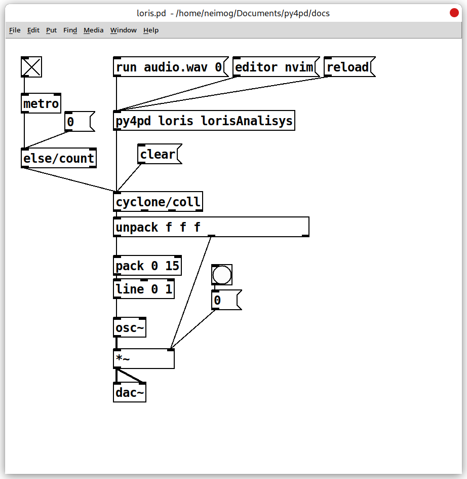

# Embedded Module

For those using Python, it is possible to communicate between Python and PureData using some of the functions in the Pd module. The Pd module is embedded in the py4pd code and accessible only in the PureData environment. It is similar to what is used inside Google Collab like `google.colab.drive`, `google.colab.widgets`, and others.

For example, to write to a PureData array you can use the method called `pd.tabwrite`, which accepts the array name and one list or numpy array and a keyword (`resize=`) where you resize or not the table. 

``` py
import pd
from random import randint

def pd_tabwrite():
    "It writes data on the pd.tabwrite array."
    randomNumbers = []
    tablen = randint(10, 200)
    i = 0
    while i < tablen:
        # gerar aleatoric number between -1 and 1
        randomNumbers.append(randint(-100, 100) / 100)
        i += 1
    pd.tabwrite("pd.tabwrite", randomNumbers, resize=True) # (1)!

```

1.  There should be an array called `pd.tabwrite` in Patch.


This will write the list `randomNumbers` in the `pd.tabwrite` table in PureData. If the table not exist it will give an error, like happens in tabwrite object.


## Table of Embedded Method

--------------------------- 
* [pd.out](###pd.out) - Output in PureData from any place in Python Code 
* [pd.send](###pd.send) - Send data to PureData, it is received with `receive` object.
* [pd.print](###pd.print) - Print in PureData console.
* [pd.tabwrite](###pd.tabwrite) - Write data in PureData arrays.
* [pd.tabread](###pd.tabread) - Read PureData arrays.
* [pd.show](###pd.show) show images in PureData canvas.
* [pd.home](###pd.home) - Get the current directory of the PureData Patch.
* [pd.tempfolder](###pd.tempfolder) - Get the tempfolder directory of `py4pd`. It's always clean.
* [pd.getkey](###pd.getkey) - Get keys saved with `key` message in `py4pd` object.
* [pd.samplerate](###pd.samplerate) - Get the current Sample Rate of PureData
* [pd.vecsize](###pd.vecsize) - Get current vector size of PureData.
-------------------------

## Methods description

### `pd.out` 

With this object you can output things without the Python function finish the work (normally we return data for PureData using `return`. For example, given this function:

``` py
import pd


def example_pdout():
    for x in range(10):
    	pd.out(x)
    return x
```
it will output 1, 2, 3 (...) as it loops. This can be used for `output` others information. For example, if I want to use the Partial Tracking provided by `loristrck`, it is possible use the `pd.out` to output the info about `frequency`, `amplitude` and `phrase` and route it using `route`.

``` py

import pd
import loristrck


def lorisAnalisys(audiofile, parcialnumber):
    audiopathname = pd.home() + '/' + audiofile
    samples, sr = loristrck.util.sndreadmono(audiopathname)
    partials = loristrck.analyze(samples, sr, resolution=30, windowsize=40, 
                      hoptime=1/120)
    selected, noise = loristrck.util.select(partials, mindur=0.02, maxfreq=12000, 
                            minamp=-60,)

    parcialnumber = int(parcialnumber) # (1)!
    pdPartial = []
    for partial in selected:
        sec2ms = int(partial[parcialnumber][0] * 1000)
        try:
            pdPartial.append(sec2ms)
            pdPartial.append(partial[parcialnumber][1])
            pdPartial.append(partial[parcialnumber][2])
            pdPartial.append(partial[parcialnumber][3])
            pd.out(pdPartial)
            pdPartial = []
        except:
            pd.out([sec2ms, 0, 0, 0])
    
	pd.print("Done")

```

1.  PureData just have floats, in indices, we need to use `int` to convert the `float` received to an `int`.

<p align="center">
  

<p align="center"><a href="./assets/EXAMPLE-pd.out.zip">Download</a></p>

</p>


---------------------------

### `pd.send` 

With `pd.send` you can send data for `receive` object in PureData Patch. It accepts two arguments, the `receive` name and the value that will be sent. For example, 
``` python
import pd


def pd_send():
    "It sends a message to the py4pdreceiver receive."	
	pd.send("py4pdreceiver", "hello from python!")
	pd.send("py4pdreceiver", 1) # (1)! 
	pd.send("py4pdreceiver", [1, 2, 3, 4, 5])
	return 0

```


### `pd.print` 

### `pd.error` 

### `pd.tabwrite` 

### `pd.tabread`
 
### `pd.show`

### `pd.home`

### `pd.tempfolder`

### `pd.getkey`
    
### `pd.samplerate`

### `pd.vecsize`


