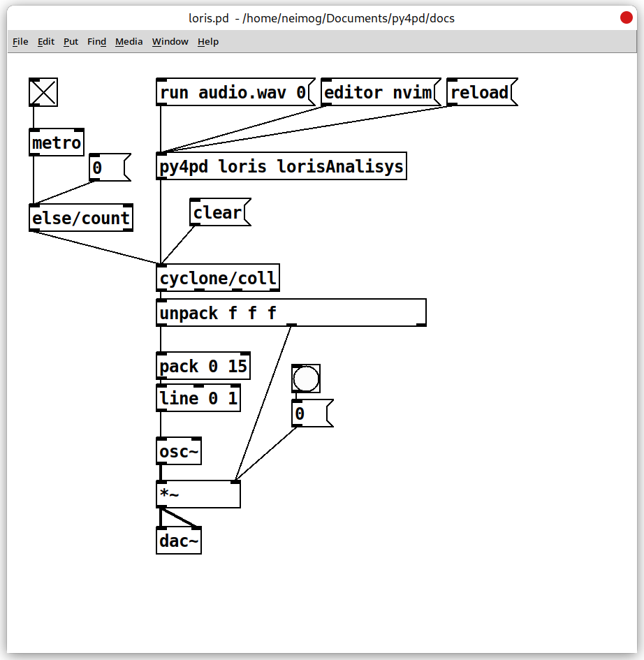

# Python Users

If you're using Python and PureData together, you can use the pd module within the py4pd package to exchange data, set configurations, and inform users of errors, among other things. This module is embedded in the py4pd code and is only accessible within the PureData environment. It's similar to how Google Collab uses modules like google.collab.drive and google.collab.widgets.

For instance, if you want to write to a PureData array, you can use the pd.tabwrite method. This method takes in the array name, a list or a numpy.array, and a resize keyword (resize=) to specify whether or not to resize the table.

``` py
import pd
from random import randint

def pd_tabwrite():
    "It writes data on the pd.tabwrite array."
    randomNumbers = []
    tablen = randint(10, 200)
    i = 0
    while i < tablen:
        # gerar aleatoric number between -1 and 1
        randomNumbers.append(randint(-100, 100) / 100)
        i += 1
    pd.tabwrite("pd.tabwrite", randomNumbers, resize=True) # (1)!

```

1.  There should be an array called `pd.tabwrite` in Patch.

This will write the list `randomNumbers` in the `pd.tabwrite` table in PureData. If the table does not exist it will give an error, like what happens in the `tabwrite` object.

-------------------------------------- 
## <h2 style="text-align:center"> **pd Methods** </h2>
--------------------------------------
### <h3 style="text-align:center"> **Write PureData Objects** </h3>


#### <h4 style="text-align:center"> `pd.addobject` </h4>

For Python users it is very simple to create new objects for PureData. For that, you define you Python Function and add it as an object using `pd.addobject`.

See this code:

``` py

import pd


def mysumObject(a, b, c, d):
    return a + b + c + d

def py4pdLoadObjects():
    pd.addobject(mysumObject, "mysumObject")

    # My License, Name and University, others information
    pd.print("", show_prefix=False)
    pd.print("GPL3 2023, Your Name", show_prefix=False)
    pd.print("University of São Paulo", show_prefix=False)
    pd.print("", show_prefix=False)

```

Here we add the function `mysumObject` in PureData enviroment. For more infos read the [Researchers](https://www.charlesneimog.com/py4pd/researchers/) page.

<p align="center">
    
</p>

-------------------------------------- 
### <h3 style="text-align:center"> **Exchanging Data** </h3>

These are the methods used to send data from Python to PureData. The inverse path is done mainly with `run` and `key` messages. 

<br>
#### <h4 style="text-align:center"> `pd.out` </h4>

`#!python pd.out()` allows you to output data to PureData without needing to wait for the Python function to finish executing. This is different from returning data to PureData using the `return` statement, which requires the function to complete before sending data. For example, consider the following function:

``` py
import pd


def example_pdout():
    for x in range(10):
    	pd.out(x)
    return x
```
When you use a loop in Python, you can use the `pd` module's `out` method to output values, similar to what you can do with `else/iterate` or `cyclone/zl iter 1`. This is useful for sending out additional information. For instance, if you want to use the Partial Tracking feature provided by the Python package `loristrck`, you can use `pd.out` to output information about the frequency, amplitude, and phase, and then save it to a `cyclone/coll` using time as a trigger.

``` py

import pd
import loristrck


def lorisAnalisys(audiofile, parcialnumber):
    audiopathname = pd.home() + '/' + audiofile
    samples, sr = loristrck.util.sndreadmono(audiopathname)
    partials = loristrck.analyze(samples, sr, resolution=30, windowsize=40, 
                      hoptime=1/120)
    selected, noise = loristrck.util.select(partials, mindur=0.02, maxfreq=12000, 
                            minamp=-60,)

    parcialnumber = int(parcialnumber) # (1)!
    pdPartial = []
    for partial in selected:
        sec2ms = int(partial[parcialnumber][0] * 1000) # time
        try:
            pdPartial.append(sec2ms) 
            pdPartial.append(partial[parcialnumber][1]) # frequency
            pdPartial.append(partial[parcialnumber][2]) # amplitude
            pdPartial.append(partial[parcialnumber][3]) # prhase
            pd.out(pdPartial) # output data to save it in the cyclone/coll
            pdPartial = []
        except:
            pd.out([sec2ms, 0, 0, 0]) # if something go wrong
    
	pd.print("Done") # Inform the user that the process is finished

```

1.  PureData just have floats, in indices, we need to use `int()` to convert the `float` received to an `int`.

<p align="center">
  

<p align="center"><a href="../assets/EXAMPLE-pd.out.zip">Download</a></p>

</p>

---------------------------

#### <h4 style="text-align:center"> `pd.send` </h4>

You can use `pd.send` to send data to a receive object in your PureData patch. This method takes in two arguments: the name of the `receive` object and the value you want to send. For instance, suppose you have a receive object named "myReceiver" in your patch. To send the value 42 to this object, you could use `pd.send("myReceiver", 42)`.

``` python
import pd


def pd_send():
    "It sends a message to the py4pdreceiver receive."	
	pd.send("py4pdreceiver", "hello from python!")
	pd.send("py4pdreceiver", 1) 
	pd.send("py4pdreceiver", [1, 2, 3, 4, 5])
	return 0

```

In this example, it will send to `py4pdreceiver` the message `"hello from python!"`, then the number `1`, then the list `[1, 2, 3, 4, 5]`. 

Let's say that you are using a lot of synths and have some color way to organize some combination of sounds(...). 

-------------------------------------- 
#### <h4 style="text-align:center"> `pd.tabwrite` </h4>

`pd.tabwrite` is a method that is essentially a copy of the `tabwrite` object in PureData. With this method, you can write audio or any numerical data to a PureData array.

Arrays are a fundamental data structure in PureData, and they can be used to store a wide range of information, such as audio signals, MIDI data, and control values. With `pd.tabwrite`, you can easily write data to an array from within your Python code.

To use `pd.tabwrite`, you first need to specify the name of the array you want to write to, followed by the data you want to write. This data can be either a `list` or a `numpy.array`. Additionally, you can use the optional `resize` keyword argument to resize the array if necessary.

Overall, `pd.tabwrite` provides a convenient way to write data to PureData arrays directly from your Python code.

-------------------------------------- 
#### <h4 style="text-align:center"> `pd.tabread` </h4>

`pd.tabread` is a method that is essentially a copy of the `tabread` object in PureData. With this method, you can read data from a PureData array directly from within your Python code.

To use `pd.tabread`, you need to specify the name of the array you want to read from. This will return a `list` or a `numpy.array` containing the data you read.

It's worth noting that `pd.tabread` requires the existence of one `array` inside the PureData Patches. If you try to read from an array that hasn't been written yet, this object will cause an error.

Overall, `pd.tabread` provides a convenient way to read data from PureData arrays directly from your Python code.


``` py
import pd

def readFromArray(arrayname):
    valuesFromArray = pd.tabread("py4pdArray")
    return values

```


-------------------------------------- 
#### <h4 style="text-align:center"> `pd.getkey` </h4>

When working with audio in py4pd, I've designed the audio functions to accept only one argument: the audio itself. This makes things simpler in many ways. However, it also raises the question of how to specify different audio parameters, such as fft-size or bandwidth. To address this, py4pd includes a function called pd.getkey, which works in conjunction with the key message in PureData.

With `pd.getkey`, you can retrieve the value of a specific key that has been set by the user in a key message. For example, if the user sends a key message to `py4pd` with the name "fft-size" and a value of 1024, you can retrieve this value in your Python code using `pd.getkey("fft-size")`. If the user hasn't defined a particular key, `pd.getkey` will return None, allowing you to set a default value if necessary.

By using `pd.getkey` in combination with the key message, you can easily specify and retrieve different audio parameters in your py4pd functions.

``` py
import pd

def someAudioFunction(audio): # (1)!
    fftvalue = pd.getkey("fft-size")
    if fftvalue == None:
        fftvalue = 2048 # default value for fft-size key.
    
    # Do something with the audio.
    
    return myGreatAudioManipulation

```

1. Remember, audio functions receive just one `arg` that is the audio. The **standart** is to use python lists, but you can turn on `numpy` array input use the message `numpy 1`. [See numpy method.](puredata-users/#numpy)

------------------

### <h3 style="text-align:center"> **Info for the user** </h3>

There are two messages used to print info in the PureData console, they are `pd.print` and `pd.error`.

<br>

#### <h4 style="text-align:center"> `pd.print` </h4>

When you want to inform the user (or yourself) of important information in PureData, you should use the `pd.print` method. This is particularly useful when debugging your Python code from within PureData. It's important to note that regular print statements will not work in PureData, so you must use `pd.print` instead.

For example, if you're using the py4pd library to debug your Python code, you can use `pd.print` to display useful information and status updates in the PureData console. Additionally, if you're working with example files and some dependencies are missing, you can use `pd.print` to inform the user what they need to do to get the patch working.

Overall, `pd.print` provides a reliable way to communicate important information to the user (or yourself) from Python code in PureData console.

-------------------------------------- 

#### <h4 style="text-align:center"> `pd.error` </h4>

If you want to inform the user of errors in your Python code when working with PureData, you should use the `pd.error` method. 

The main difference between `pd.print` and `pd.error` is that info printed with `pd.error` are displayed in red text in the console, making them more noticeable and easy to identify. 

Overall, using pd.error can help you effectively communicate errors to the user and improve the debugging process when working with Python and PureData. 

-------------------------------------- 

### <h3 style="text-align:center"> **Images** </h3>
 
<br>

#### <h4 style="text-align:center"> `pd.show` </h4>

If you want to display images inside your PureData patches using Python, you can use the pd.show method. This method is essentially a copy of the else/pic object, but with an interface that allows you to easily show images from within your Python code.

One important thing to note is that pd.show only works with `.png`, `.gif`, and `.ppm` image formats. However, this is usually enough to work with a wide range of images and can be particularly useful when working with scores in PureData.

For example, you can use the `neoscore` Python library along with `pd.show` to display scores directly in your PureData patches. This provides a complete and useful way to work with scores in PureData, and can greatly enhance your ability to work with music and audio data in your patches.
Overall, `pd.show` provides a convenient way to display images from within your Python code, and can be a valuable tool when working with PureData.

``` py
import pd
from random import randint
import os
try:
    from neoscore.common import *
except Exception as e:
    pd.error(str(e))
    pd.error(
        "Please, run 'pip install neoscore -t ./py-modules' in the terminal from current folder")


def getpitchKey(pitch):
    note = {
        # natural
        'c': ['c', ''],
        'd': ['d', ''],
        'e': ['e', ''],
        'f': ['f', ''],
        'g': ['g', ''],
        'a': ['a', ''],
        'b': ['b', ''],
        # sharp
        'c#': ['c', 'accidentalSharp'],
        'd#': ['d', 'accidentalSharp'],
        'e#': ['e', 'accidentalSharp'],
        'f#': ['f', 'accidentalSharp'],
        'g#': ['g', 'accidentalSharp'],
        'a#': ['a', 'accidentalSharp'],
        'b#': ['b', 'accidentalSharp'],
        # flat
        'cb': ['c', 'accidentalFlat'],
        'db': ['d', 'accidentalFlat'],
        'eb': ['e', 'accidentalFlat'],
        'fb': ['f', 'accidentalFlat'],
        'gb': ['g', 'accidentalFlat'],
        'ab': ['a', 'accidentalFlat'],
        'bb': ['b', 'accidentalFlat'],
    }
    return note[pitch]


def chord(pitches):
    try:
        neoscore.shutdown()
    except BaseException:
        pass
    neoscore.setup()
    py4pdTMPfolder = pd.tempfolder()
    for file in py4pdTMPfolder:
        if file.endswith(".ppm"):
            try:
                os.remove(py4pdTMPfolder + "/" + file)
            except BaseException:
                pass
    staffSoprano = Staff((Mm(0), Mm(0)), None, Mm(30))
    trebleClef = 'treble'
    Clef(ZERO, staffSoprano, trebleClef)
    staffBaixo = Staff((ZERO, Mm(15)), None, Mm(30))
    bassClef = 'bass'
    Clef(ZERO, staffBaixo, bassClef)
    Path.rect((Mm(-10), Mm(-10)), None, Mm(42), Mm(42),
              Brush(Color(0, 0, 0, 0)), Pen(thickness=Mm(0.5)))
    for pitch in pitches:
        # in pitch remove not number
        pitchWithoutNumber = pitch.replace(pitch[-1], '')
        pitchOctave = int(pitch[-1])
        pitchClass, accidental = getpitchKey(pitchWithoutNumber)
        note = [(pitchClass, accidental, pitchOctave)]
        if pitchOctave < 4:
            Chordrest(Mm(5), staffBaixo, note, (int(1), int(1)))
        else:
            Chordrest(Mm(5), staffSoprano, note, (int(1), int(1)))
    randomNumber = randint(1, 100)
    notePathName = py4pdTMPfolder + "/" + pitch + f"{randomNumber}.ppm"
    neoscore.render_image(rect=None, dest=notePathName, dpi=150, wait=True)
    neoscore.shutdown()
    if os.name == 'nt':
        notePathName = notePathName.replace("\\", "/")
    pd.show(notePathName) ## HERE THE pd.show
    return None

```

<p align="center">
  
</p>

To use this script, you can create a `py4pd` object environment with `py4pd -score score chord`. 

-------------------------------------- 
### <h3 style="text-align:center"> **File Management** </h3>
-------------------------------------- 

Next is presented `pd.home` and `pd.tempfolder`. These functions can be useful for managing files in PureData and Python.

-------------------------------------- 
#### <h4 style="text-align:center"> `pd.home` </h4>

In `py4pd`, `pd.home` is a function that returns the path to the directory where the currently-running PureData patch is located. This can be useful for accessing files and resources relative to the location of the patch. 

-------------------------------------- 


#### <h4 style="text-align:center"> `pd.tempfolder` </h4>

`pd.tempfolder` is used get one tempfolder to save stuff that won't be used more than once. In `pd.show` I am using `pd.tempfolder`. All the data inside this folder will be deleted after you close PureData or delete all `py4pd` objects. The tempfolder is located in `~/.py4pd` for Windows, Linux and Mac and it is a hidden folder on Windows too.

`pd.tempfolder` returns the path to a temporary folder that can be used to store data that is only needed temporarily. In `pd.show` example I am using this function to store image files that are displayed in the patch. Any data stored in the tempfolder is automatically deleted when the patch is closed or all `py4pd` objects are deleted. The tempfolder is located at ~/.py4pd.

-------------------------------------- 

### <h3 style="text-align:center"> **Audio Info** </h3>
    
<br>
#### <h4 style="text-align:center"> `pd.samplerate` </h4>

This get the current samplerate of PureData. You can use the `pd.SAMPLERATE` variable too.

-------------------------------------- 

#### <h4 style="text-align:center"> `pd.vecsize` </h4>

This get the current vectorsize/blocksize of PureData. You can use the `pd.VECSIZE` variable too.


