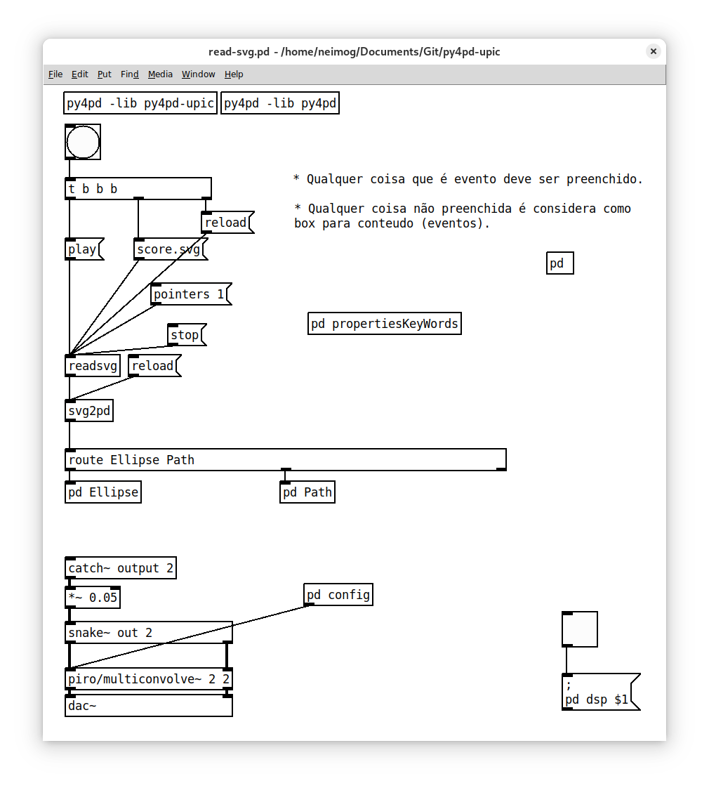
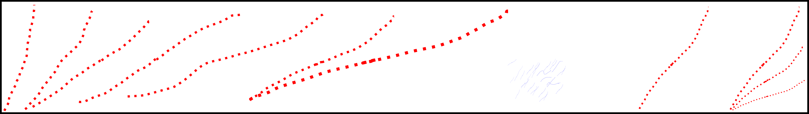

Used to create functions like sum numbers, convertion between datas (svg to scores, for example), etc. This objects are the more simple but the more useful, you create it using `pd.add_object` or `pd.new_object`. Inside the folder resources of the `py4pd` code you will find a lot of examples of these objects, we also have some py4pd libraries, like `py4pd-upic`, `py4pd-ji`, `py4pd-freesound`, `py4pd-partials`.

### `py4pd-upic`

    

    

    <audio controls style="width: 75%; border-radius: 10px;">
        <source src="../../../examples/py4pd-upic/audio.wav" type="audio/mpeg">
        Your browser does not support the audio element.
    </audio>

