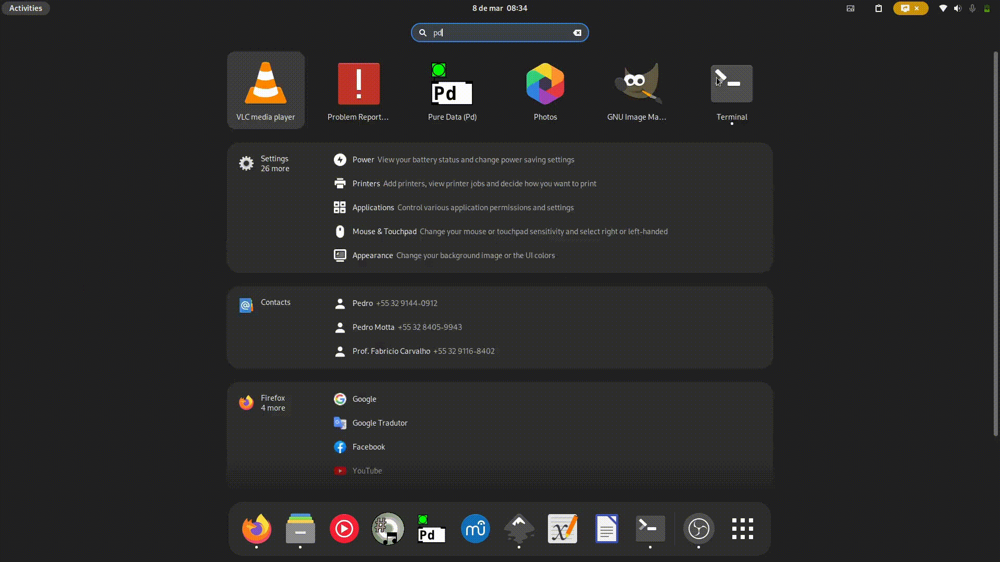

# Start

## Setup

### Install `py4pd`

First, open PureData, `Help->Find Externals->` search for `py4pd` then select py4pd and click on `Install`: 

<figure markdown>
  { width="900" }
  <figcaption>Process of install py4pd on PureData</figcaption>
</figure>

### Install Python

Then, **for now**, you must install Python .

* **Linux**: `sudo dnf install python3.11` or `sudo apt install python3.11`;
* **MacOS**: Go to [Python.org](https://www.python.org/downloads/release/python-3112/) and install normally.
* **Windows**: Go to [Python.org](https://www.python.org/downloads/release/python-3112/) and install normally.

The version of Python always need to follow the version used in the compilation process:
  
| py4pd  version     | Python   version                            |
| :---------: | :----------------------------------: |
| 0.5.0       | [Python 3.11](https://www.python.org/downloads/release/python-3112/)  |
| 0.4.0       | [Python 3.11](https://www.python.org/downloads/release/python-3112/)  |
| 0.3.0       | [Python 3.10](https://www.python.org/downloads/release/python-31010/)  |
| 0.2.0       | [Python 3.10](https://www.python.org/downloads/release/python-3105/)  |
| 0.1.0       | [Python 3.10](https://www.python.org/downloads/release/python-3103/)  |
| 0.0.0       | [Python 3.10](https://www.python.org/downloads/release/python-3101/)  |

## Object creation options (Args)

For the creation of the object, there is a lot of options. You need to pay attention to this.

### Audio options

If the Python function that you are using work with audio, you need to create the object with one of this argument `-audioin`, `-audioout` or `-audio`.

* `-audioin`: It creates one object that accepts audio input but no audio output, this can be used for audio analysis. Like `sigmund~`.
* `-audioout`: It creates one object that accepts audio output but no audio input, this can be used for create some synthesis process inside Python.
* `-audio`: It creates one object that accepts audio input and output, this is used for create audio manipulation in Python.

### Canvas options

There are options to create canvas options in PureData. This can be used for show images, score, graphs and others.

* `-canvas`: It creates an clear canvas where, from Python, you can show things inside PureData. See some examples:
* `-score`: It creates an clear score used to show scores inside PureData. This is part of `py4pd` scripts. You can use, `py4pd -score score note` to show one single note, `py4pd -score score chord` to show chords, and soon will be possible to use `py4pd -score score chord-seq` to show chord-seq (yes, like OpenMusic and OM-Sharp). 

### Editor options

For who works with Python, you can set the IDE `editor` in the creation of the `py4pd`. For now, we have four implemented IDEs:

* `-vscode`: It is the default IDE, you do not need to use `-vscode` at least you have an `py4pd.cfg` file.
* `-nvim`: It sets `nvim` as the editor of `py4pd`.
* `-emacs`: It sets `emacs` as the editor of `py4pd`.
* `-sublime`: It sets `sublime` as the editor of `py4pd`.

### Set function

You can set functions in the creation of the object. For that, you must put the script name and then the function name. The name of the script file always need be the first. You can you `py4pd -canvas score note`, `py4pd score note -canvas` but `py4pd note score -canvas` will not work when the script name is `score.py` and `note` is the function.
